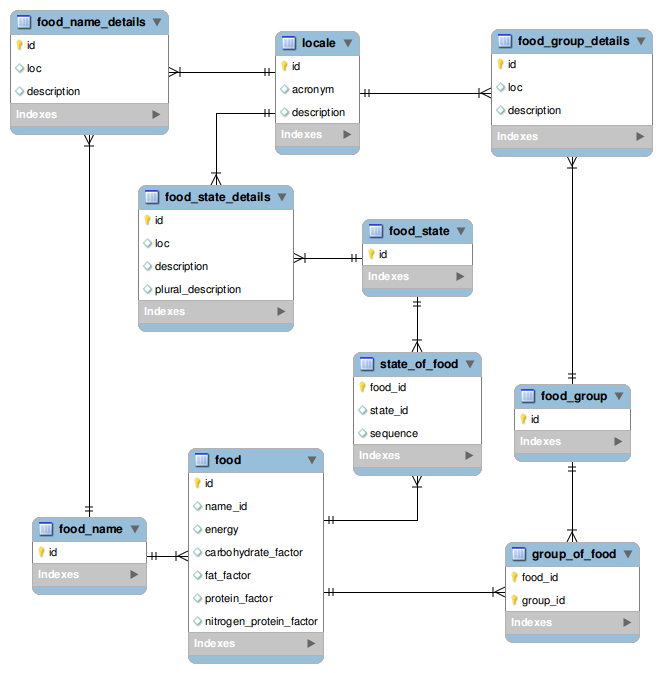

Welcome to uniVocity
====================
**[uniVocity](http://www.univocity.com)** is a data integration framework for Java that provides a fast and flexible foundation for the 
implementation of complex data mappings and transformations.

### uniVocity is not like other data integration solutions: ###

**maintain the information that is mapped from one place to another:** uniVocity detects data updates and you can 
easily configure how modifications in one or more data sources should be reflected in one or more destinations. A client purchase was cancelled in one of your legacy systems? Just execute a uniVocity mapping cycle to transfer this update to the databases used by other systems in your company. uniVocity will detect when data has been updated, deleted or when it has to be inserted. All you need to do is to configure your data mappings.

**Keep *information consistency* in mappings between different schemas:** you can generate and maintain associations among pieces of information extracted
from diverse data sources, while easily keeping the information consistent and up to date. For example, you can migrate data from a row of a 
CSV file and spread it to 5 different destination tables of a database. uniVocity is able to identify updates on the input file and consistently update the information previously mapped while maintaining referential integrity.

**Map data in batch or in real-time:** you can populate a data increment with just a few records and use uniVocity to update other databases in any other system;
or simply execute a batch to map all data in a set of database tables, files and objects of your applications

**Use data from anywhere and transform it into anything:** uniVocity provides an extremely simple and powerful API that allows you to use objects, methods and 
services in your JVM-based applications while mapping data between data stores.

**Backward compatibility - *for life*:** uniVocity is divided in 2 libraries: a [public API](http://github.com/uniVocity/univocity-api) library and an implementation library. Just write your code against the public API, test and forget. Any new version of uniVocity will continue to support the existing public APIs.

**Faster than anything else**: our team has years of experience with low latency, concurrent and distributed systems. Even if you try to implement your own
data integration solution from scratch, it is likely to be error-prone, hard to maintain and slower than uniVocity.

**With uniVocity, you can have your data integration needs solved at a fraction of the time and cost:** Data integration can become very hard and complex,
very quickly. uniVocity was carefully engineered to simplify the development process to a great extent. With it, you should be able to implement a full-fledged
data integration solution in less than a day!

We created the [uniVocity-examples](http://github.com/uniVocity/univocity-examples) project to demonstrate the capabilities of our product and to quickly guide you through the main functionalities that can be used to make your life easier. uniVocity provides a flexible and easy to use API that gives you total control over your data and how it is transformed.
 
Have a go and try uniVocity free for 30 days, without any other restrictions. 

Just download it from our website: **[www.univocity.com](http://www.univocity.com)** and save you and your team from the pain of developing your own 
data integration solution from the ground up.

**Don't forget to also check our open-source project [uniVocity-parsers](http://github.com/uniVocity/univocity-parsers)**:

 It is developed and maintained by our team and made available to the open source community.
 We want you to contribute to this project! We documented everything to make it easier for you to modify or create new powerful and feature-complete 
 parsers using just a few lines of code.


## Let's get started! ##

### Table of contents ###

 * [Installation](#installation)

  * [Maven settings](#maven-settings)

  * [Obtaining a license](#obtaining-a-license)

 * [Introduction](#introduction)

  * [Background](#background)

  * [The data input example](#the-data-input-example)

  * [Configuring the data stores](#configuring-the-data-stores)

  * [uniVocity engine initialization](#univocity-engine-initialization)

 * [Essential building blocks](#essential-building-blocks)

  * [Copying data from CSV to Fixed-width entities](#copying-data-from-csv-to-fixed-width-entities)

  * [Using row readers to manage rows](#using-row-readers-to-manage-rows)

  * [Functions](#functions)

  * [Reference mappings](#reference-mappings)

  * [Intercepting engine lifecycle activities](#intercepting-engine-lifecycle-activities)

  * [Map functions](#map-functions)

  * [Objects with functions](#objects-with-functions)

 * [Queries, more functions, and variables](#queries,-more-functions,-and-variables)

  * [Using parameters and variables](#using-parameters-and-variables)

 * [Mapping between incompatible schemas](#mapping-between-incompatible-schemas)

 * [Input management](#input-management)

  * [Input sharing](#input-sharing)

  * [Data increments](#data-increments)

  * [Update prevention](#update-prevention)

  * [Dataset producers](#dataset-producers)

 * [Advanced](#advanced)

  * [Persistent scope](#persistent-scope)

  * [Custom entities](#custom-entities)

  * [Advanced settings for JDBC entities](#advanced-settings-for-jdbc-entities)

 * [Project Roadmap](#project-roadmap)


## Installation ##


To install uniVocity, you need two artifacts: 

1. the [public API](http://github.com/uniVocity/univocity-api), which provides the essential interfaces and configuration options to configure data inputs,
   outputs, and their mappings. You must write your code against the interfaces provided by this API. 

2. our data integration engine implementation, which can be downloaded from our [website](www.univocity.com) or from our [maven](http://maven.apache.org) repository (http://artifacts.univocity.com). 

We split the API so your code can be totally isolated from our implementation code. Any new version of uniVocity will support the published API's 
so you can update uniVocity transparently without worrying about compilation errors and code rewrites.  

### Maven settings ###

If you use [Maven](http://maven.apache.org), you'll need to add an entry for our repository to your `pom.xml` in order to obtain the `univocity` jar.

```xml
    
    <repositories>
        <repository>
            <id>univocity-releases</id>
            <url>http://artifacts.univocity.com/release</url>
        </repository>
    </repositories>
```

These are the dependencies you need to include in your `pom.xml`:

```
    
    <dependencies>
    ...
        <dependency>
            <groupId>com.univocity</groupId>
            <artifactId>univocity</artifactId>
            <version>1.0.0</version>
            <type>jar</type>
        </dependency>
    
        <dependency>
            <groupId>com.univocity</groupId>
            <artifactId>univocity-api</artifactId>
            <version>1.0.0</version>
            <type>jar</type>
        </dependency>
    ...
    </dependencies>
    
```

**Note**: univocity-api is in the [Maven Central Repository](http://search.maven.org)

To get get access to uniVocity *snapshot* releases, add an additional `repository` entry to the `repositories` section of your `pom.xml`:

```xml
    
    <repositories>
        ...
        <repository>
            <id>univocity-releases</id>
            <url>http://artifacts.univocity.com/snapshot</url>
        </repository>
    </repositories>
    
```

### Obtaining a license ###

uniVocity will only run with a license file. Simply execute the `com.univocity.LicenseRequest` class from the `univocity` jar file and provide your details to generate a license request file. Send your license request to licenses@univocity.com and you will receive your license file shortly after.  

Once you receive your `license.zip` file, all you need to do is to place it in your classpath so `uniVocity` can validate it and start up. You can also place the license file anywhere in your computer and invoke `Univocity.setLicensePath("/path/to/your/license.zip");` before starting the data integration engine.

*You can find more information about licenses [here](http://www.univocity.com/pages/license-request)* 

## Introduction ##

### Background ###

uniVocity is essentially a data mapping framework built around the concept of data stores and their entities:

 * A *data entity* is an abstraction for any software component that provides data in tabular format, such as: database tables, CSV files, arrays of objects, etc.
   It must provide:
  * A sequence of fields names that define the information stored for each individual record. 
  * A means to retrieve records, update and delete them, or write new ones. The entity can support all these operations or 
   be just read-only or write-only.
 * A *data store* is an abstraction for any software component that provides and manages access to one or more data entities: databases, CSV file directories, 
   sets of files, custom Java objects, etc. It can provide these additional features:
  * queries: treated by uniVocity as a read-only data entity that is represented by a string. The string defines some data retrieval operation, and
   its behavior is determined by the data store implementation. Queries can accept parameters if required.
  * transactional behavior: the data store can rollback/commit any changes made to its data entities in case of errors.     

With these components, uniVocity lets you create complex data mappings that define how information should flow from one data entity to another.
That's all you need to know for now, so let's get started.

### The data input example ###

In our example, we are interested in synchronizing data of foods and groups of foods with another data store.

As the source data store, we will be using a stripped-down version of the nutrient database provided by the 
[U.S. Department of Agriculture](http://www.ars.usda.gov/ba/bhnrc/ndl).

We provide this data in a couple of files that you can find  [here](http://github.com/uniVocity/univocity-examples/tree/master/src/test/resources/examples/source_data/csv).
Some of the original data was modified to make the examples easier to read.

The tables we are interested in are: [FD_GROUP.csv](http://github.com/uniVocity/univocity-examples/tree/master/src/test/resources/examples/source_data/csv/FD_GROUP.csv) for general
groups of food and [FOOD_DES.csv](http://github.com/uniVocity/univocity-examples/tree/master/src/test/resources/examples/source_data/csv/FOOD_DES.csv) for individual food descriptions. 
These are stored in 2 CSV files with the following content:


``` FD_GROUP.csv

	"FdGrp_CD","FdGrp_Desc"
	"0100","Dairy and Egg Products"
	"1200","Spices and Herbs"
	"0300","Baby Foods"
	"1400","Fats and Oils"
	"1500","Poultry Products"


```

And


``` FOOD_DES.csv

	"NDB_No","FdGrp_Cd","Long_Desc","Shrt_Desc","ComName","ManufacName","Survey","Ref_Desc","Refuse","SciName","N_Factor","Pro_Factor","Fat_Factor","CHO_Factor"
	"01001","0100","Butter, salted","BUTTER,WITH SALT",,,"Y",,0,,2.38,4.27,1.89,8.87
	"01002","1400","Butter, whipped, with salt","BUTTER,WHIPPED,WITH SALT",,,"Y",,0,,8.38,3.27,2.79,1.87
	"01004","0100","Cheese, blue","CHEESE,BLUE",,,"Y",,0,,4.38,9.27,4.59,3.87
	"01005","0100","Cheese, brick","CHEESE,BRICK",,,"Y",,0,,4.38,5.27,6.79,8.87
	"01007","0100","Cheese, camembert","CHEESE,CAMEMBERT",,,"Y",,0,,5.38,6.27,2.79,3.87
	"01008","0100","Cheese, caraway","CHEESE,CARAWAY",,,,,0,,6.36,6.27,8.79,3.89
	"01009","0100","Cheese, cheddar","CHEESE,CHEDDAR",,,"Y",,0,,6.33,4.22,8.13,3.12
	"01010","0100","Cheese, cheshire","CHEESE,CHESHIRE",,,,,0,,4.78,4.67,0.79,3.13
	"01110","0300","Milk shakes, thick chocolate","MILK SHAKES,THICK CHOC",,,,,0,,8.38,0.27,3.79,1.87
	"01111","0300","Milk shakes, thick vanilla","MILK SHAKES,THICK VANILLA",,,,,0,,3.98,8.97,3.69,3.87


```

### Configuring the data stores ###

To use these files as data entities in uniVocity, we need to configure a data store. uniVocity comes with its own
CSV data store implementation, so all you need to do is configure it:


```java

	
	//This creates a new data store for CSV files. uniVocity provides a few basic data stores out of the box,
	//but you can always create your own (see com.univocity.api.entity.custom.CustomDataStoreFactory)
	CsvDataStoreConfiguration csvDataStore = new CsvDataStoreConfiguration("csvDataStore");
	
	//This adds all files under the specified path to the data store. Each file will be
	//considered an individual data entity.
	csvDataStore.addEntities("examples/source_data/csv");
	


```

To make the following examples simple and easy to read, we will map the contents of these CSV files to a destination data store 
that contains fixed-width entities. We don't have these entities physically on disk so all data will be written to a `String`.
This will require a little bit of extra configuration to provide the essential information required by uniVocity. We will need to define the
entities, their names, their fields and which fields should be used as identifiers.


```java

	
	//This creates a new data store for fixed-width entities. Let's call it "fixedWidthDestination"
	FixedWidthDataStoreConfiguration fixedWidthDataStore = new FixedWidthDataStoreConfiguration("fixedWidthDestination");
	
	//Here we create a write-only fixed-with entity named "food_group". All data written to this entity
	//will end up in a String. You can also use files, resources in the classpath or custom writers/readers as entities.
	foodGroupOutput = new StringWriterProvider();
	fixedWidthDataStore.addEntity("food_group", foodGroupOutput);
	
	//We will also need a "food" entity.
	foodOutput = new StringWriterProvider();
	fixedWidthDataStore.addEntity("food", foodOutput);
	
	//Let's define the default settings that should be used for all entities in this data store
	FixedWidthEntityConfiguration defaults = fixedWidthDataStore.getDefaultEntityConfiguration();
	
	//By default, we want to write headers to the output (i.e. the first row that displays the name of each column).
	defaults.setHeaderWritingEnabled(true);
	
	//We also want underscore (instead of whitespace) to highlight unwritten spaces in the fixed-width fields.
	defaults.getFormat().setPadding('_');
	
	//Use a question mark to denote null values in the output (instead of simply leaving it blank in the output)
	defaults.setNullValue("?");
	
	//Let's configure the entities: uniVocity needs to know what the records of each entity look like.
	//As these are not files with headers, nor database tables, we need to provide this information manually.
	
	//To configure an entity, simply get its configuration from the data store:
	FixedWidthEntityConfiguration foodGroupConfig = fixedWidthDataStore.getEntityConfiguration("food_group");
	
	//Set the names of each field in the entity food_group. These will become the headers in the output.
	foodGroupConfig.setHeaders("id", "name");
	
	//A fixed-width entity depends on the length of each field. This configures "id" to use 6 spaces, and "name" to use 35
	foodGroupConfig.setFieldLengths(6, 35);
	
	//Marks the "id" field as the identifier of records in food_group.
	foodGroupConfig.setIdentifiers("id");
	
	//Now for the "food" entity:
	FixedWidthEntityConfiguration foodConfig = fixedWidthDataStore.getEntityConfiguration("food");
	foodConfig.setHeaders("id", "group", "description", "scientific_name");
	foodConfig.setFieldLengths(8, 6, 40, 20);
	foodConfig.setIdentifiers("id");
	


```

### uniVocity engine initialization ###

Having the data stores configured, we can finally configure and initialize a data integration engine:


```java

	
	//Creates a new engine configuration to map data between entities in CSV and fixed-width data stores
	EngineConfiguration engineConfig = new EngineConfiguration(engineName, csvDataStore, fixedWidthDataStore);
	
	//Registers this engine configuration.
	Univocity.registerEngine(engineConfig);
	


```

In order to perform complex mappings and enable different data management strategies, uniVocity relies on a couple of metadata tables.
If you don't provide an explicit configuration for these tables in an [EngineConfiguration](http://github.com/uniVocity/univocity-api/tree/master/src/main/java/com/univocity/api/config/EngineConfiguration.java) object, uniVocity will automatically start
an in-memory database to store this information. All metadata information in this in-memory database will be lost once the engine is stopped.

While the in-memory metadata is very convenient for testing and initial development purposes, it is probably not enough for most real-world applications.
Make sure your [EngineConfiguration](http://github.com/uniVocity/univocity-api/tree/master/src/main/java/com/univocity/api/config/EngineConfiguration.java) provides access to these tables in a database of your preference, unless you just need basic persistence functionalities. 

## Essential building blocks ##

The following sections introduce the basic building blocks that allow you to use uniVocity to create powerful data mappings.

### Copying data from CSV to Fixed-width entities ###

With a data integration engine registered into uniVocity, we can obtain an instance of [DataIntegrationEngine](http://github.com/uniVocity/univocity-api/tree/master/src/main/java/com/univocity/api/engine/DataIntegrationEngine.java) and define data mappings:


```java

	
	//Obtains the configured engine instance
	DataIntegrationEngine engine = Univocity.getEngine(engineName);
	
	//Creates a mapping between the csv and fixed-width data stores.
	DataStoreMapping mapping = engine.map("csvDataStore", "fixedWidthDestination");
	
	//With a data store mapping, we can define the mapping between their entities.
	
	//We will map csvDataStore.FD_GROUP to fixedWidthDestination.food_group
	EntityMapping foodGroupMapping = mapping.map("FD_GROUP", "food_group");
	
	//Here we associate FD_GROUP.FdGrp_CD to food_group.id. Values will be copied directly between source and destination.
	//The identity mapping defines that an association should be created for each record mapped between source and destination.
	//A new entry will be added to uniVocity's metadata, containing the source and destination values mapped here.
	//This linkage enables complex mapping operations that will be demonstrated later.
	foodGroupMapping.identity().associate("FdGrp_CD").to("id");
	
	//Copies values from FD_GROUP.FdGrp_Desc to food_group.name
	foodGroupMapping.value().copy("FdGrp_Desc").to("name");
	
	//Configures the mapping to delete all rows in the destination to then insert all rows mapped from the source
	foodGroupMapping.persistence().usingMetadata().deleteAll().insertNewRows();
	
	//Executes a data mapping cycle with the entity mappings defined so far.
	engine.executeCycle();
	
	


```

The first step is to map a source data store to a destination data store, and then map their data entities.

When establishing a mapping between entities, it is mandatory to define an identifier mapping. This mapping must ensure that both source and destination values
form a unique representation of each record (similarly to primary keys in a database). The identifier does not need to be a primary key of a database, and uniVocity
won't perform any validation against its contents. If the source data can contain duplicates, you can manage that and discard/transform any anomaly with the features
described in the following sections. The identifier values of both source and destination will have their `String` representation used in uniVocity metadata tables.
Therefore, you must ensure identifiers can be converted from/to `String` consistently. 
uniVocity enables the use of transformations that can be used to achieve this if required. 

Mappings can be auto-detected by default if field names match in both source in destination (or if you provide a [NameMatcher](http://github.com/uniVocity/univocity-api/tree/master/src/main/java/com/univocity/api/engine/NameMatcher.java)).
As this is not the case in the example, we must create the mappings between values manually. `value().copy("FdGrp_Desc").to("name")` does what it says: it copies
the value in "FdGrp_Desc" to "name".

Then, we can configure the appropriate persistence settings. This configuration determines what should happen to the destination data when a mapping cycle is executed.
In this example, we will store the identity values in uniVocity's metadata, and all values in the source entity will be deleted before inserting.

With the mappings properly defined, we can execute a data mapping cycle and see what data ended up being written in the `food_group` fixed-width entity :


```

	id____name_______________________________
	0100__Dairy and Egg Products_____________
	1200__Spices and Herbs___________________
	0300__Baby Foods_________________________
	1400__Fats and Oils______________________
	1500__Poultry Products___________________


```

In general, the steps taken so far are the first thing you will do when creating your own data mappings. But we expect your input data to
be much, much more intricate than that. uniVocity provides many tools for you to easily handle such intricacies. Let's explore some of them.


### Using row readers to manage rows ###

One of the most powerful tools in uniVocity is the [RowReader](http://github.com/uniVocity/univocity-api/tree/master/src/main/java/com/univocity/api/engine/RowReader.java). With it you can intercept rows as soon as they are loaded from the source,
then modify, log, perform calculations, etc, and then send them over to uniVocity to continue with the mapping process. Once uniVocity has a mapped row, and is ready
to send it to the destination entity, you can use a [RowReader](http://github.com/uniVocity/univocity-api/tree/master/src/main/java/com/univocity/api/engine/RowReader.java) to intercept and manipulate the row before it is written.
Finally, after the row is successfully persisted, uniVocity modifies the 
row if needed (typically, when generated values are produced by the destination entity upon insertion of new records), and exposes it to RowReaders again.

In the following example we use the same mapping as before, but now we attach a RowReader to the input for discarding unwanted rows.
We also attach a RowReader to the output for converting all food group names to uppercase before writing to the output:


```java

	
	//Obtains the engine instance already configured
	DataIntegrationEngine engine = Univocity.getEngine(engineName);
	
	//Gets the existing data store mapping
	DataStoreMapping mapping = engine.getMapping("csvDataStore", "fixedWidthDestination");
	
	//Gets the existing entity mapping
	EntityMapping foodGroupMapping = mapping.getMapping("FD_GROUP", "food_group");
	
	//We can easily manipulate the input and output rows before, during and after they are mapped. To do so we use a RowReader.
	//Here we add a RowReader to discard the first 3 rows in the input.
	foodGroupMapping.addInputRowReader(new RowReader() {
	
		@Override
		public void processRow(Object[] inputRow, Object[] outputRow, RowMappingContext context) {
			if (context.getCurrentRow() <= 3) {
				context.discardRow();
			}
		}
	});
	
	//This rowReader converts descriptions to uppercase. This is an output rowReader, so we have access to
	//all data already mapped from the input, and ready to be written to the output.
	foodGroupMapping.addOutputRowReader(new RowReader() {
	
		private int name;
	
		@Override
		public void initialize(RowMappingContext context) {
			//for performance reasons, we use the initialize method to get the index of any fields we are interested in
			//before changing the output Rows. Here we get index of the output field "name"
			name = context.getOutputIndex("name");
		}
	
		@Override
		public void processRow(Object[] inputRow, Object[] outputRow, RowMappingContext context) {
			//converts the food group name in the destination row to uppercase
			outputRow[name] = outputRow[name].toString().toUpperCase();
		}
	});
	
	//Executes a data mapping cycle again
	engine.executeCycle();
	
	


```

In this example we simply get the existing mapping, add our [RowReader](http://github.com/uniVocity/univocity-api/tree/master/src/main/java/com/univocity/api/engine/RowReader.java)s and execute the mapping cycle again. The action happens in [RowReader](http://github.com/uniVocity/univocity-api/tree/master/src/main/java/com/univocity/api/engine/RowReader.java)'s `processRow` method:
this method exposes the original input row and the mapped row (if any) that is going to be inserted into a destination entity. The [RowMappingContext](http://github.com/uniVocity/univocity-api/tree/master/src/main/java/com/univocity/api/engine/RowMappingContext.java) is provided by
uniVocity so you can have more control over and information about the mapping in execution. The names of each mapped field, both in the input or output, 
can be obtained from this contextual object, as well as their positions in the input/output arrays. If you are manipulating a huge input, we recommend that you
acquire the positions of fields you are interested in manipulating using the `initialize()` method.    

After executing a data mapping cycle with these [RowReader](http://github.com/uniVocity/univocity-api/tree/master/src/main/java/com/univocity/api/engine/RowReader.java) implementations, the output will contain 2 rows (the first 3 rows in the input were skipped): 


```

	id____name_______________________________
	1400__FATS AND OILS______________________
	1500__POULTRY PRODUCTS___________________


```

Note that you can have multiple [RowReader](http://github.com/uniVocity/univocity-api/tree/master/src/main/java/com/univocity/api/engine/RowReader.java)s defined for each step of the process (input, output, persisted). In this case they will be executed sequentially and
changes made by the first [RowReader](http://github.com/uniVocity/univocity-api/tree/master/src/main/java/com/univocity/api/engine/RowReader.java) will reflect on the next. A row discarded by one [RowReader](http://github.com/uniVocity/univocity-api/tree/master/src/main/java/com/univocity/api/engine/RowReader.java) won't be passed on to the next. 
 
While powerful, [RowReader](http://github.com/uniVocity/univocity-api/tree/master/src/main/java/com/univocity/api/engine/RowReader.java)s are more suitable for mappings that require very specific operations. In short, they are not particularly easy to reuse,
especially when you just want to perform some common data cleanup or transformations on fields processed by different mappings.


### Functions ###

uniVocity engines allow you to provide functions that can be used during the execution of a data mapping cycle.
Functions are especially useful to transform input values, and to provide input to destination fields in data mappings.

As functions can perform operations that are potentially expensive (such as invoking a web service somewhere to get an account number in another system),
they are associated with a scope. The scope in uniVocity is bound to each individual data integration engine instance. 
The following scopes, defined in [EngineScope](http://github.com/uniVocity/univocity-api/tree/master/src/main/java/com/univocity/api/engine/EngineScope.java), are supported:

1.	PERSISTENT: outlives the data integration engine (depends on user configuration)
2.	APPLICATION: values are retained and reused while the engine is active
3.	CYCLE: values are retained and reused while a mapping cycle is active
4.	MAPPING: values are retained and reused while an individual entity mapping is active
5.	STATELESS: no values are retained and reused.
 
When a function is invoked, its signature, arguments and result are stored into the scope with which it has been associated. A subsequent function invocation within the same scope,
with the same arguments, will not trigger the function. Instead, the result obtained previously will be returned. This will happen until the scope is left.
 
Getting back to our example, let's see how they can be put to work:


```java

	
	
	//Adds a function to the engine that converts Strings to Integers.
	//The APPLICATION scope makes the engine retain and reuse the result of function calls
	//using a given parameter, until the engine is shut down.
	engine.addFunction(EngineScope.APPLICATION, "toInteger", new FunctionCall<Integer, String>() {
		@Override
		public Integer execute(String input) {
			return Integer.parseInt(input);
		}
	});
	
	//Adds a function to the engine that converts Strings to lower case.
	//With the CYCLE scope, values are held while a cycle is active. Once it completes all
	//values in this scope will be discarded.
	engine.addFunction(EngineScope.CYCLE, "toLowerCase", new FunctionCall<String, String>() {
		@Override
		public String execute(String input) {
			return input.toLowerCase();
		}
	});
	
	//Adds a function to the engine that trims Strings.
	//With the STATELESS scope, results of function calls are never reused.
	engine.addFunction(EngineScope.STATELESS, "trim", new FunctionCall<String, String>() {
		@Override
		public String execute(String input) {
			return input.trim();
		}
	});
	
	//Gets the existing data store mapping
	DataStoreMapping mapping = engine.getMapping("csvDataStore", "fixedWidthDestination");
	
	//Removes the existing entity mapping
	mapping.removeMapping("FD_GROUP", "food_group");
	
	//We will map csvDataStore.FD_GROUP to fixedWidthDestination.food_group again
	EntityMapping foodGroupMapping = mapping.map("FD_GROUP", "food_group");
	
	//Here we associate FD_GROUP.FdGrp_CD to food_group.id, but now FdGrp_CD will be converted to an integer value
	//before being associated with the destination id
	foodGroupMapping.identity().associate("FdGrp_CD").to("id").readWith("toInteger");
	
	//Copies values from FD_GROUP.FdGrp_Desc to food_group.name. All values read from FdGrp_Desc will be
	//trimmed then converted to lower case, as specified in the sequence of functions
	foodGroupMapping.value().copy("FdGrp_Desc").to("name").readingWith("trim", "toLowerCase");
	
	//Configures the mapping to keep all rows in the destination and only insert new rows in the source
	//Records mapped in a previous cycle won't be discarded nor updated.
	foodGroupMapping.persistence().usingMetadata().deleteDisabled().updateDisabled().insertNewRows();
	
	//Executes a data mapping cycle again
	engine.executeCycle();
	
	


```

As you can see, functions are added to the engine, and referred to in mappings by their name, without arguments.
This mapping uses 2 functions: `copy("FdGrp_Desc").to("name").readingWith("trim", "toLowerCase")`.Here the values in "FdGrp_Desc" 
will be transformed by the "trim" function, and the result will then be passed on to "toLowercase"

Also notice we changed the mapping's persistence settings with ` persistence().usingMetadata().deleteDisabled().updateDisabled().insertNewRows()`.
This means we won't be updating existing rows. (Remember what was done in the previous example? We had 2 rows with uppercase letters.) Although this is a new mapping
and the previous one was discarded, the metadata will be used to identify which rows NOT to update.  

The result of the execution of this new mapping will be:


```

	id____name_______________________________
	1400__FATS AND OILS______________________
	1500__POULTRY PRODUCTS___________________
	100___dairy and egg products_____________
	1200__spices and herbs___________________
	300___baby foods_________________________


```

The result shows the previous 2 rows in uppercase and 3 new, all in lower case and, as a result of the `toInteger` function, no leading zeros. 

### Reference mappings ###

Analogous to foreign keys in a database, uniVocity supports the concept of references to identifiers produced in other mappings. 

Now, we want to map the CSV entity `FOOD_DES` to the fixed-width entity `food`. The [FOOD_DES.csv](http://github.com/uniVocity/univocity-examples/tree/master/src/test/resources/examples/source_data/csv/FOOD_DES.csv) file has the field `FdGrp_Cd`, which contains references to [FD_GROUP.csv](http://github.com/uniVocity/univocity-examples/tree/master/src/test/resources/examples/source_data/csv/FD_GROUP.csv).

In the previous example, the identity mapping between `FD_GROUP` and `food_group` was declared as: `identity().associate("FdGrp_CD").to("id")`. 
We want to maintain this association on the destination data store, instead of simply copying from whatever is in the input. 

To do that, we need to give uniVocity the basic metadata it needs to be able to locate identifiers previously 
mapped, and potentially transformed, by previous mappings.

A reference mapping is declared like this: `reference().using("FdGrp_Cd").referTo("FD_GROUP", "food_group").on("group")`

1. The `.using("FdGrp_Cd")` part tells uniVocity to read the value of this field in `FOOD_DES` (the source entity)
2. `.referTo("FD_GROUP", "food_group")` tells uniVocity to read the metadata generated by a mapping from "FD_GROUP" to "food_group".
   It will use the values read from "FOOD_DES.FdGrp_Cd" to find the identifier previously persisted to "food_group"
3. `.on("group")` defines what field in the destination entity (in this case "food.group") should receive the identifier restored from the metadata. 

References that could not be matched will be set to null by default. You can also choose to discard the row entirely, use a placeholder or abort the mapping cycle entirely.

The following example demonstrates how [FOOD_DES.csv](http://github.com/uniVocity/univocity-examples/tree/master/src/test/resources/examples/source_data/csv/FOOD_DES.csv) can be mapped to `food`:


```java

	
	//Gets the existing data store mapping
	DataStoreMapping mapping = engine.getMapping("csvDataStore", "fixedWidthDestination");
	
	//Let's add a mapping between the food description CSV and the in-memory, fixed-with entity
	EntityMapping foodMapping = mapping.map("FOOD_DES", "food");
	foodMapping.identity().associate("NDB_No").to("id");
	foodMapping.value().copy("Long_Desc", "SciName").to("description", "scientific_name");
	
	//In the source data store, FOOD_DES contains a reference to FD_GROUP. In the destination, "food" contains a reference to "food_group".
	//The reference mapping uses uniVocity's metadata to restore references to identifiers that were mapped and transformed.
	//
	//Our mapping from FD_GROUP to "group" transformed the values in "FdGrp_Cd" to integers, using the "toInteger" function.
	//Now, when reading the field in FOOD_DES that references FD_GROUP, we need to convert its values using the "toInteger" function.
	//The results will be used to query uniVocity's metadata and restore the corresponding values used as identifiers of "food_group"
	foodMapping.reference().using("FdGrp_Cd").referTo("FD_GROUP", "food_group").on("group").readingWith("toInteger");
	
	foodMapping.persistence().usingMetadata().deleteAll().insertNewRows();
	
	//Executes a data mapping cycle again
	engine.executeCycle();
	
	


```

The output of this mapping will be:


```

	id____name_______________________________
	1400__FATS AND OILS______________________
	1500__POULTRY PRODUCTS___________________
	100___dairy and egg products_____________
	1200__spices and herbs___________________
	300___baby foods_________________________
	
	id______group_description_____________________________scientific_name_____
	01001___100___Butter, salted__________________________?___________________
	01002___1400__Butter, whipped, with salt______________?___________________
	01004___100___Cheese, blue____________________________?___________________
	01005___100___Cheese, brick___________________________?___________________
	01007___100___Cheese, camembert_______________________?___________________
	01008___100___Cheese, caraway_________________________?___________________
	01009___100___Cheese, cheddar_________________________?___________________
	01010___100___Cheese, cheshire________________________?___________________
	01110___300___Milk shakes, thick chocolate____________?___________________
	01111___300___Milk shakes, thick vanilla______________?___________________


```


### Intercepting engine lifecycle activities ###

Each time the data integration engine is executed, several lifecycle events take place:

 - A data mapping cycle is started

 - An entity mapping is started within the cycle

 - The entity mapping is finalized

 - The mapping cycle is finalized

 - The engine becomes ready to execute a new data mapping cycle

 - An engine shutdown process is started

 - The engine stops completely

To obtain notifications about one or more of such events when they happen, you can use an [EngineLifecycleInterceptor](http://github.com/uniVocity/univocity-api/tree/master/src/main/java/com/univocity/api/engine/EngineLifecycleInterceptor.java). This allows you to
prepare for, or to perform cleanup after, each lifecycle event. uniVocity provides an [EngineLifecycleContext](http://github.com/uniVocity/univocity-api/tree/master/src/main/java/com/univocity/api/engine/EngineLifecycleContext.java) object to its interceptors,
so you can obtain more detailed information about the current state of the engine.

The following example prints out a few messages of an [EngineLifecycleInterceptor](http://github.com/uniVocity/univocity-api/tree/master/src/main/java/com/univocity/api/engine/EngineLifecycleInterceptor.java) in action.


```java

	
	engine.addInterceptor(new EngineLifecycleInterceptor() {
	
		//prints the current active scope in the engine.
		private String getScope(EngineLifecycleContext context) {
			return ". Current scope: " + context.getExecutionContext().getCurrentActiveScope();
		}
	
		//prints the current mapping being executed. The --X arrow represents a data removal
		//operation, whilst the --> represents a data mapping.
		private String getMapping(EngineLifecycleContext context) {
			EntityMappingContext entityMapping = context.getCurrentEntityMapping();
			String arrow = entityMapping.isExclusionMapping() ? " --X " : " --> ";
			return entityMapping.getSourceEntity() + arrow + entityMapping.getDestinationEntity();
		}
	
		//Executed when the engine becomes available after a data mapping cycle.
		@Override
		public void engineReady(EngineLifecycleContext context) {
			String name = context.getEngineName();
			int cycle = context.getCurrentCycle();
	
			println(out, name + " ready. Cycles executed: " + cycle + getScope(context));
		}
	
		//Called when a data mapping cycle has been started
		@Override
		public void cycleStarted(EngineLifecycleContext context) {
			println(out);
			println(out, "Starting new cycle: " + context.getCurrentCycle() + getScope(context));
		}
	
		//Called when an individual mapping between two entities is about to be executed.
		//Note some mappings can be exclusion mappings generated automatically by uniVocity
		//when deletions are enabled in the entity mappings.
		@Override
		public void mappingStarted(EngineLifecycleContext context) {
			println(out, "  Executing: " + getMapping(context) + getScope(context));
		}
	
		//Called when an individual mapping between two entities has been completed
		@Override
		public void mappingCompleted(EngineLifecycleContext context) {
			println(out, "  Completed: " + getMapping(context) + getScope(context));
		}
	
		//Called when a data mapping cycle has been completed
		@Override
		public void cycleCompleted(EngineLifecycleContext context) {
			println(out, "Completed cycle: " + context.getCurrentCycle() + getScope(context));
			println(out);
		}
	
		//Called when the engine begins to shut down
		@Override
		public void engineShuttingDown(EngineLifecycleContext context) {
			println(out, "Shutting down " + context.getEngineName());
		}
	
		//Called when the shut down process is finalized and the engine is effectively stopped.
		@Override
		public void engineStopped(EngineLifecycleContext context) {
			println(out, context.getEngineName() + " shut down.");
		}
	});
	
	//executes a mapping cycle to trigger some interceptor methods.
	engine.executeCycle();
	
	//shuts down the engine to trigger "engineShuttingDown" and "engineStopped"
	Univocity.shutdown(engineName);
	
	


```

The execution of this code will produce the following output: 


```

	
	Starting new cycle: 5. Current scope: CYCLE
	Executing: FOOD_DES --X food. Current scope: MAPPING
	Completed: FOOD_DES --X food. Current scope: MAPPING
	Executing: FD_GROUP --> food_group. Current scope: MAPPING
	Completed: FD_GROUP --> food_group. Current scope: MAPPING
	Executing: FOOD_DES --> food. Current scope: MAPPING
	Completed: FOOD_DES --> food. Current scope: MAPPING
	Completed cycle: 5. Current scope: CYCLE
	
	engine_001 ready. Cycles executed: 5. Current scope: APPLICATION
	Shutting down engine_001
	engine_001 shut down.


```

### Map functions ###

`Maps` can be used as functions, where the input parameter of the function is used as a key to retrieve a value from the map. For example:


```java

	
	//Maps can be used as functions as well. Here we create a map from
	//codes of food groups to descriptions:
	Map<String, String> groupCodeToGroupNames = new HashMap<String, String>();
	groupCodeToGroupNames.put("0100", "Dairy");
	groupCodeToGroupNames.put("0300", "Baby");
	groupCodeToGroupNames.put("1400", "Fats");
	
	//This will create a function named "getNameOfGroup" that will use the given map to produce values
	engine.addMap("getNameOfGroup", groupCodeToGroupNames);
	
	//Let's test this function with a mapping to food descriptions:
	EntityMapping foodMapping = mapping.map("FOOD_DES", "food");
	foodMapping.identity().associate("NDB_No").to("id");
	//Here we invoke the "getNameOfGroup" function using values read from FdGrp_CD
	//This will return the description associated with each code in the map.
	foodMapping.value().copy("FdGrp_CD").to("group").readingWith("getNameOfGroup");
	foodMapping.value().copy("Long_Desc").to("description");
	
	engine.executeCycle();
	


```

In the above code, we created a `Map` from group codes to their descriptions. By creating a mapping using `copy("FdGrp_CD").to("group").readingWith("getNameOfGroup")`, we
assign the values in `FdGrp_CD` as parameters of the map function `getNameOfGroup`. The function will then return a group name for each code, and this name will be
written to the destination field `group`. 

The execution of this code will produce the following output: 


```

	id______group_description_____________________________scientific_name_____
	01001___Dairy_Butter, salted__________________________?___________________
	01002___Fats__Butter, whipped, with salt______________?___________________
	01004___Dairy_Cheese, blue____________________________?___________________
	01005___Dairy_Cheese, brick___________________________?___________________
	01007___Dairy_Cheese, camembert_______________________?___________________
	01008___Dairy_Cheese, caraway_________________________?___________________
	01009___Dairy_Cheese, cheddar_________________________?___________________
	01010___Dairy_Cheese, cheshire________________________?___________________
	01110___Baby__Milk shakes, thick chocolate____________?___________________
	01111___Baby__Milk shakes, thick vanilla______________?___________________


```


### Objects with functions ###

In many situations having functions in isolation is insufficient to handle more complex data mappings. There are cases when information must
processed in multiple steps, or the value of one or more functions must be determined from the state of an object. To handle such cases, uniVocity
lets you annotate multiple methods of your classes with the [FunctionWrapper](http://github.com/uniVocity/univocity-api/tree/master/src/main/java/com/univocity/api/config/annotation/FunctionWrapper.java) annotation.

In the following example, we use an instance of the [NameSplitter](http://github.com/uniVocity/univocity-examples/tree/master/src/test/java/com/univocity/examples/NameSplitter.java) class. 
It will be used split `String`s between commas and assign a numeric value to each unique `String`. The numeric values that represent each
component of the input `String` will then be concatenated with the pipe character. The `toCodes` method of this class is annotated with
`@FunctionWrapper(scope = EngineScope.APPLICATION)`, and uniVocity will create a function with it so it can be used as a function in mappings:


```java

	
	//Here we use an object whose class contains methods annotated with @FunctionWrapper.
	//The annotated methods in this object will be used to create functions accessible by uniVocity.
	//This is useful to manipulate the state of data using multiple functions and to expose
	//information from a complex object that can't be easily used in mappings or datasets.
	NameSplitter splitter = new NameSplitter();
	engine.addFunctions(splitter);
	
	DataStoreMapping mapping = engine.map("csvDataStore", "fixedWidthDestination");
	
	EntityMapping foodMapping = mapping.map("FOOD_DES", "food");
	foodMapping.identity().associate("NDB_No").to("id");
	//Here we call the "toCodes" function in our splitter object to convert each string after a comma into a code.
	//Each description in the destination will have numeric codes concatenated with the pipe character.
	foodMapping.value().copy("Long_Desc").to("description").readingWith("toCodes");
	
	engine.executeCycle();
	


```

In the example above, `engine.addFunctions(splitter)` will create a function named `toCodes` in the engine. It is just a wrapper around the original
method of the *splitter* instance. The mapping declaring `copy("Long_Desc").to("description").readingWith("toCodes")` will send the original
food descriptions to this *toCodes* function and the result will be written to the destination field *description*.

The output will be as follows:
	

```

	1 - butter
	2 - salted
	3 - whipped
	4 - with salt
	5 - cheese
	6 - blue
	7 - brick
	8 - camembert
	9 - caraway
	10 - cheddar
	11 - cheshire
	12 - milk shakes
	13 - thick chocolate
	14 - thick vanilla
	
	id______group_description_____________________________scientific_name_____
	01001___?_____1|2_____________________________________?___________________
	01002___?_____1|3|4___________________________________?___________________
	01004___?_____5|6_____________________________________?___________________
	01005___?_____5|7_____________________________________?___________________
	01007___?_____5|8_____________________________________?___________________
	01008___?_____5|9_____________________________________?___________________
	01009___?_____5|10____________________________________?___________________
	01010___?_____5|11____________________________________?___________________
	01110___?_____12|13___________________________________?___________________
	01111___?_____12|14___________________________________?___________________


```

## Queries, more functions, and variables ##

uniVocity strives for convenience. We thought it would be convenient to use SQL to produce data from your entities. Your data store doesn't even need to be a database!
In the following example, we tell uniVocity to enable database-like operations in the CSV entities. In the
example class [Tutorial002QueriesFunctionsAndVariables](http://github.com/uniVocity/univocity-examples/tree/master/src/test/java/com/univocity/examples/Tutorial002QueriesFunctionsAndVariables.java), we did that by configuring the data store width 
`enableDatabaseOperationsIn("FD_GROUP", "FOOD_DES")` and providing the length of each field in entities *FD_GROUP* and *FOOD_DES*.

When database operations are enabled for any entity, an in-memory database will be created automatically, and all data in these entities will be dumped
into in-memory tables. Here's an example of how you can take advantage of this feature to easily create data mappings:


```java

	
	//As database-like operations are enabled for FD_GROUP and FOOD_DES, we can create a SQL query with them
	engine.addQuery(EngineScope.CYCLE, "groupsInUse") //scope and name of the query. CYCLE scope will make the engine reuse results within a cycle
			.onDataStore("csvDataStore") // data store name where the query will be executed.
			.fromString(" " +
					" SELECT fdgrp_cd AS id, fdgrp_desc AS name " +	// *NOTE* we are giving labels to the column names here.
					" FROM fd_group g " +
					" WHERE fdgrp_cd IN ( SELECT DISTINCT fdgrp_Cd FROM food_des ) " +
					" ORDER BY fdgrp_desc ASC "
			).returnDataset(); // this query returns a dataset that can be used as the source entity in entity mappings.
	
	//Let's create a mapping between the CSV and fixed-width data stores.
	DataStoreMapping mapping = engine.map("csvDataStore", "fixedWidthDestination");
	
	//Here we map the result of the query to the fixed-width entity "food_group"
	//Note the query name is declared within curly braces.
	EntityMapping queryMapping = mapping.map("{groupsInUse}", "food_group");
	
	//As we labeled the columns in the query to be the same as in the destination entity,
	//we can just use auto-detection and all fields with similar names will be associated, including identifiers.
	queryMapping.autodetectMappings();
	
	//Let's execute and  check the output
	engine.executeCycle();
	


```

In this example, we want to map only the food groups that are actually used. To do that, we add a query to the engine using 
`engine.addQuery(EngineScope.CYCLE, "groupsInUse")`. This will create a query with the name *groupsInUse*, and its results will be reused within the mapping cycle: 
if multiple mappings depend on the data returned by *groupsInUse*, the SQL query won't be executed again until a new mapping cycle is started.

The `.onDataStore("csvDataStore")` indicates to which data store the query applies.

`.from`String`(" select ... ` is the query itself. You can also use queries from files and resources in your classpath. Notice the select statement has a label for each
selected column, and the labels match the fields names in the destination entity. We did that so we could use auto-detection, instead of mapping each field manually.

Finally `.returnDataset` tells the engine to return the query results as a [Dataset](http://github.com/uniVocity/univocity-api/tree/master/src/main/java/com/univocity/api/data/Dataset.java). [Dataset](http://github.com/uniVocity/univocity-api/tree/master/src/main/java/com/univocity/api/data/Dataset.java)s can be used as regular entities in any mapping.
In this case, the dataset will be produced with the result of the query, and its field names will match the labels of the select statement.

With the *groupsInUse* query properly built and initialized, an entity mapping is created using `map("{groupsInUse}", "food_group")`.
Notice the curly braces around the query name. These indicate the source entity is a function. We are effectively mapping a function to an entity.      

Lastly, `queryMapping.autodetectMappings()` will create mappings between fields with the same name. As the dataset produced by our query contains the
field names *id* and *name*, and the destination entity *food_group* contains fields with these names, the mappings will be automatically created. As the destination 
entity *food_group* was configured with *id* as its identifier, an identity mapping will be created for this field. 

After executing the mapping cycle, the output contains only the food groups that are actually used in [FOOD_DES.csv](http://github.com/uniVocity/univocity-examples/tree/master/src/test/resources/examples/source_data/csv/FOOD_DES.csv):


```

	id____name_______________________________
	0300__Baby Foods_________________________
	0100__Dairy and Egg Products_____________
	1400__Fats and Oils______________________


```

### Using parameters and variables ###

Queries can also be parameterized and used as functions anywhere. The following example demonstrates how you can define and use them in conjunction with variables.


```java

	
	//This query uses the description of a food group to find and return its code.
	//Note that queries that do not return a dataset are simply functions that can be used everywhere.
	//Parameters: groupDescription
	engine.addQuery(EngineScope.MAPPING, "findGroupCode")
			.onDataStore("csvDataStore")
			.fromString("SELECT fdgrp_cd FROM fd_group WHERE fdgrp_desc like :groupDescription")
			.returnSingleValue() //expects one single result.
			.directly() // just returns the result without applying any function to it.
			.onErrorAbort(); //if the query does not return any value, or returns more than one value, abort the data mapping cycle.
	
	//Locates all foods that are part of a given group and that have a given description.
	//In SQL queries used by uniVocity's entities, parameters must be set in the order they appear in a query.
	//Parameters: foodGroupCode and foodDescription
	//Custom entities provided by you can use any other approach to determine how queries and parameters are processed.
	engine.addQuery(EngineScope.STATELESS, "foodsOfGroup")
			.onDataStore("csvDataStore")
			.fromString(" SELECT * FROM food_des WHERE fdgrp_cd = :foodGroupCode AND Shrt_Desc like :foodDescription")
			.returnDataset();
	
	DataStoreMapping mapping = engine.getMapping("csvDataStore", "fixedWidthDestination");
	
	//Here we define our mapping using a parameterized query: Parameters can be other functions, variable names, constants or plain strings.
	//This expression will be evaluated as follows:
	// 1 - The value of the variable "groupName" will be sent to the "findGroupCode" query, producing the code of the given food group.
	//     This result is then used to set the "foodGroupCode" parameter.
	// 2 - The value of variable "foodName" will be used to set the "foodDescription" parameter
	// 3 - The "foodsOfGroup" query will be called with these parameter values, and return a dataset that can be used to map data to "food".
	EntityMapping queryMapping = mapping.map("{foodsOfGroup(findGroupCode($groupName), $foodName)}", "food");
	
	//Here we map the column names in the dataset produced by the "foodsOfGroup" query to the fields in "food".
	queryMapping.identity().associate("NDB_No").to("id");
	queryMapping.value().copy("Long_Desc", "SciName").to("description", "scientific_name");
	queryMapping.reference().using("{findGroupCode($groupName)}").referTo("{groupsInUse}", "food_group").on("group");
	queryMapping.persistence().usingMetadata().deleteDisabled().updateDisabled().insertNewRows();
	
	//Before executing the cycle, let's set the values of each variable we are using as a parameter in "foodsOfGroup"
	engine.setVariable("groupName", "Dairy%");
	engine.setVariable("foodName", "CHEESE%");
	engine.executeCycle();
	
	printDataInEntities(output, "After first cycle:");
	
	//Let's change the variables and execute the cyle again.
	engine.setVariable("groupName", "Baby Foods");
	engine.setVariable("foodName", "%");
	engine.executeCycle();
	
	printDataInEntities(output, "After second cycle:");
	


```

The first query, *findGroupCode*, contains the named parameter `:groupDescription`. The `.returnSingleValue` option mandates that just one value should be returned.
`.directly` indicates no function will be applied to the result of this query, and `.onErrorAbort` will make the query throw an exception in case an 
unexpected result is produced. In this case, an unexpected result would be more than one value, or no value at all, being produced.

The next query, *foodsOfGroup*, contains two named parameters: `:foodGroupCode` and `:foodDescription`. This query returns a [Dataset](http://github.com/uniVocity/univocity-api/tree/master/src/main/java/com/univocity/api/data/Dataset.java).

With the queries defined, a very different entity mapping is created: `map("{foodsOfGroup(findGroupCode($groupName), $foodName)}", "food")`.
This mapping uses the *foodsOfGroup* function to produce a dataset and map it to the destination entity *food*.
However, *foodsOfGroup* takes two parameters: the code of a food group, and the description of a food. Instead of using a literal value, we chose
to use the *findGroupCode* function to fetch food group codes. The $ sign in `$groupName` indicates there is a variable with the name *groupName*.
When executing this mapping, uniVocity will read the value of the variable *groupName* and invoke the function *findGroupCode* with it. The result
will be passed on to the fist parameter of the function *foodsOfGroup*, and its second parameter will receive the value of the variable *foodName*.

In this example, the variables *groupName* and *foodName* are set using the commands `engine.setVariable("groupName", "Dairy%")` and
`engine.setVariable("foodName", "CHEESE%")`, before executing a mapping cycle.

> ** Important: ** when using parameterized functions/queries as source entities, the *signature* is used to generate the metadata entries, not the actual variable values.
> This may have implications when detecting data updates for the destination entity. For example, if your mapping is configured with the `deleteAbsent` persistence setting:
> 
> 1. Records will be mapped mapped using a set of variable values
> 2. On the next cycle, if the values of these variables changed, the resulting dataset may be different.
> 3. uniVocity will remove records previously mapped, that are not in the current dataset.   
> 
> If you don't want such behavior, then you may need to consider creating a duplicate entity mapping using literal values instead of variables.

There's also an interesting reference mapping in this example: `reference().using("{findGroupCode($groupName)}").referTo("{groupsInUse}", "food_group").on("group")`

This reference mapping uses the result of the function call `findGroupCode($groupName)` to obtain the code of a food group. The result is applied to uniVocity's metadata
to discover which identifier was used in the destination of mapping *{groupsInUse} -> food_group* (from the previous example). The identifier restored from uniVocity's
metadata will then be copied to food's *group* field.  

Finally, we set the variables *groupName* to "Dairy%" and *foodName* to "CHEESE%", execute a mapping cycle, then print the results.
Next, we set them again to "Baby Foods" and "%" respectively. The result of both mapping cycles is as follows:  


```

	After first cycle:
	-- Food groups --
	id____name_______________________________
	0300__Baby Foods_________________________
	0100__Dairy and Egg Products_____________
	1400__Fats and Oils______________________
	
	
	-- Foods --
	id______group_description_____________________________scientific_name_____
	01004___0100__Cheese, blue____________________________?___________________
	01005___0100__Cheese, brick___________________________?___________________
	01007___0100__Cheese, camembert_______________________?___________________
	01008___0100__Cheese, caraway_________________________?___________________
	01009___0100__Cheese, cheddar_________________________?___________________
	01010___0100__Cheese, cheshire________________________?___________________
	
	After second cycle:
	-- Food groups --
	id____name_______________________________
	0300__Baby Foods_________________________
	0100__Dairy and Egg Products_____________
	1400__Fats and Oils______________________
	
	
	-- Foods --
	id______group_description_____________________________scientific_name_____
	01004___0100__Cheese, blue____________________________?___________________
	01005___0100__Cheese, brick___________________________?___________________
	01007___0100__Cheese, camembert_______________________?___________________
	01008___0100__Cheese, caraway_________________________?___________________
	01009___0100__Cheese, cheddar_________________________?___________________
	01010___0100__Cheese, cheshire________________________?___________________
	01110___0300__Milk shakes, thick chocolate____________?___________________
	01111___0300__Milk shakes, thick vanilla______________?___________________


```

## Mapping between incompatible schemas ##

One of the most powerful features of uniVocity is probably how easy it is to map data between different schemas, consistently. To demonstrate how this works
we are going to map data in the [FD_GROUP.csv](http://github.com/uniVocity/univocity-examples/tree/master/src/test/resources/examples/source_data/csv/FD_GROUP.csv) and [FOOD_DES.csv](http://github.com/uniVocity/univocity-examples/tree/master/src/test/resources/examples/source_data/csv/FOOD_DES.csv) files to a peculiar database.
This database stores food information and their descriptions in multiple languages

The following entity-relationship diagram shows how its tables are associated:


The database DDL scripts are located [here](http://github.com/uniVocity/univocity-examples/tree/master/src/test/resources/examples/new_schema). 

In this example, we will populate the following tables:

 * LOCALE - the languages supported in the database.
 * FOOD_GROUP - groups of foods (without their descriptions)
 * FOOD_GROUP_DETAILS - descriptions and locale dependent information of each FOOD_GROUP
 * FOOD_NAME - names of foods (without locale dependent information)
 * FOOD_NAME_DETAILS - descriptions and locale dependent information of each FOOD_NAME
 * FOOD - food information: name, proteins, energy, etc.
 * GROUP_OF_FOOD - join table between foods and different groups.

The data integration engine will now be initialized with a [JdbcDataStoreConfiguration](http://github.com/uniVocity/univocity-api/tree/master/src/main/java/com/univocity/api/entity/jdbc/JdbcDataStoreConfiguration.java). First we need to create a configuration object for the database.
As uniVocity is able to query the JDBC data store to return all information it needs (tables, columns and primary keys), 
the configuration effort is fairly minimal:


```java

	
	//Creates a new JDBC data store based on a javax.sql.DataSource, with the name "new_schema".
	//Upon initialization, uniVocity will try to auto-detect all available tables, columns and primary keys
	//If this doesn't work you still can configure each table manually.
	JdbcDataStoreConfiguration newSchemaDataStore = new JdbcDataStoreConfiguration("newSchema", dataSource);
	
	//The database contains lots of internal tables in addition to the tables we are interested in
	//By setting the schema to "public", these internal database tables won't be made available to uniVocity.
	newSchemaDataStore.setSchema("public");
	


```

The [CsvDataStoreConfiguration](http://github.com/uniVocity/univocity-api/tree/master/src/main/java/com/univocity/api/entity/text/csv/CsvDataStoreConfiguration.java) remains the same as before. We just need to register the engine.


```java

	
	//Creates a new engine configuration to map data between the entities in CSV and JDBC data stores
	EngineConfiguration engineConfig = new EngineConfiguration(engineName, csvDataStore, newSchemaDataStore);
	
	//Registers this engine configuration.
	Univocity.registerEngine(engineConfig);
	


```

With the engine ready, all we need to do is to configure the mappings and execute a mapping cycle:


```java

	
	DataIntegrationEngine engine = Univocity.getEngine(engineName);
	
	//Let's create a mapping between the CSV and JDBC data stores
	DataStoreMapping dsMapping = engine.map("csvDataStore", "newSchema");
	
	//Every entity mapping will be created with the following defaults for handling data
	dsMapping.configurePersistenceDefaults().usingMetadata().deleteDisabled().updateModified().insertNewRows();
	
	//Let's create two variables to represent the current locale information.
	engine.setVariable("locale", "en_US");
	engine.setVariable("localeDescription", "American English");
	
	EntityMapping mapping;
	
	//Here we create mapping from expressions to the destination entity "locale". No data in the source data store is required
	mapping = dsMapping.map("locale");
	//The value of the "locale" variable will be associated with the generated ID in the "locale" table.
	mapping.identity().associate("{$locale}").toGeneratedId("id");
	//The values of variables "locale" and "localeDescription" will be copied to "acronym" and "description" columns
	mapping.value().copy("{$locale}", "{$localeDescription}").to("acronym", "description");
	
	//This mapping just creates generated ID's in "food_group". Each generated ID will be associated with a value of "FdGrp_CD"
	mapping = dsMapping.map("FD_GROUP", "food_group");
	mapping.identity().associate("FdGrp_CD").toGeneratedId("id");
	
	//Next, we map the values in FD_GROUP to the locale-specific "food_group_details"
	mapping = dsMapping.map("FD_GROUP", "food_group_details");
	//Using the code in "FdGrp_CD" and the current value of the "locale" variable, we define an identifier association to "id" and "loc", respectively.
	//The values in "id" and "loc" are references to the identifiers mapped above.
	mapping.identity().associate("FdGrp_CD", "{$locale}").to("id", "loc");
	//We use the "FdGrp_CD" to obtain the identifiers generated in a mapping from "FD_GROUP" to "food_group".
	//The identifier written to "food_group" will be copied to "id".
	mapping.reference().using("FdGrp_CD").referTo("FD_GROUP", "food_group").on("id");
	//Here we use the current value in the "locale" variable to restore the identifier generated in the mapping to "locale".
	//This identifier will be copied to "loc"
	mapping.reference().using("{$locale}").referTo(null, "locale").on("loc");
	//Just copy the food group description
	mapping.value().copy("FdGrp_Desc").to("description");
	
	//Again, we just associate values of "FOOD_DES" to a generated ID in the destination "food_name".
	mapping = dsMapping.map("FOOD_DES", "food_name");
	mapping.identity().associate("NDB_No").toGeneratedId("id");
	
	//Similarly to the mapping from "FD_GROUP" to "food_group_details", we just map identity fields and references
	mapping = dsMapping.map("FOOD_DES", "food_name_details");
	mapping.identity().associate("NDB_No", "{$locale}").to("id", "loc");
	mapping.reference().using("NDB_No").referTo("FOOD_DES", "food_name").on("id");
	mapping.reference().using("{$locale}").referTo(null, "locale").on("loc");
	mapping.value().copy("Long_Desc").to("description");
	
	//Here the basic food composition data in "FOOD_DES" is mapped to the "food" entity.
	mapping = dsMapping.map("FOOD_DES", "food");
	mapping.identity().associate("NDB_No").toGeneratedId("id");
	// "food.name_id" is a reference to "food_name". We use "NDB_No" to obtain the ID generated in the mapping from "FOOD_DES" to "food_name"
	mapping.reference().using("NDB_No").referTo("FOOD_DES", "food_name").on("name_id");
	// let's finally copy the food composition data
	mapping.value().copy("CHO_Factor", "Fat_Factor", "Pro_Factor", "N_Factor").to("carbohydrate_factor", "fat_factor", "protein_factor", "nitrogen_protein_factor");
	
	//Lastly, we associate each "food" to a "food_group". Once again, this is easily achieved with the use of reference mappings.
	mapping = dsMapping.map("FOOD_DES", "group_of_food");
	mapping.identity().associate("NDB_No", "FdGrp_CD").to("food_id", "group_id");
	mapping.reference().using("NDB_No").referTo("FOOD_DES", "food").on("food_id");
	mapping.reference().using("FdGrp_CD").referTo("FD_GROUP", "food_group").on("group_id");
	
	//In this cycle, the current locale is "en_US".
	engine.executeCycle();
	
	//Let's now use another locale. All tables with locale-specific data will have new descriptions associated with this new locale.
	engine.setVariable("locale", "en_GB");
	engine.setVariable("localeDescription", "British English");
	engine.executeCycle();
	
	//Finally, let's print all tables and see how the data looks like:
	printAndValidate(printTables());
	
	


```

This example is not very different from what we've seen, but some novelties can be highlighted:

**Locale**

 * An entity mapping from "nowhere" to the destination entity *locale*: `mapping = dsMapping.map("locale")` maps values from expressions/variables
in the engine context only.
 * `identity().associate("{$locale}").toGeneratedId("id")` will associate the current value in the *locale* variable to a generated identifier of the *locale table* 

**Mapping to *food_group* and *food_group_details***
 * In `map("FD_GROUP", "food_group")`, there is only one mapping: `identity().associate("FdGrp_CD").toGeneratedId("id")`. When a new value for *FdGrp_CD* appears on 
   the input entity, uniVocity will insert an empty row into *food_group*. This will produce a generated identifier. This identifier is associated with the value in
   *FdGrp_Cd* using uniVocity's metadata.
   
 * Next, on `map("FD_GROUP", "food_group_details")`, the destination entity *food_group_details* is a table with a composite primary key: *id* is a foreign key that 
   references *food_group*, and *loc* is another foreign key that references to *locale*. To map this properly, we need to configure 3 field mappings:
   
  * `identity().associate("FdGrp_CD", "{$locale}").to("id", "loc")`: this will link the values of *FdGrp_CD* to *food_group_details.id*, and the current value 
     of variable *locale* to *food_group_details.loc*. The values won't be written to the destination, the reference mappings will obtain the correct references. 
  * `reference().using("FdGrp_CD").referTo("FD_GROUP", "food_group").on("id")`: using the values in *FdGrp_CD*, uniVocity will have to query its metadata to discover
     which IDs were generated in the mapping from *FD_GROUP* to *food_group*. It will obtain the correct generated ID's in *food_group* and copy them 
     to *food_group_details.id*.
  * `reference().using("{$locale}").referTo(null, "locale").on("loc")`: using the current value of variable *locale*, uniVocity will once again query its metadata to discover
     which ID was generated in the mapping to the *locale* table. As the mapping to *locale* does contain a source entity, we use *null* as the source entity. 
     This mapping will obtain the correct generated ID in the *locale* table and copy it to *food_group_details.loc*.

The remainder of this code is very similar and we hope it is easier to understand at this point. Here is how the migrated data should look like in the destination database:


```

	===[ locale ]===
	id___acronym___description________________________________________
	0____en_US_____American English___________________________________
	1____en_GB_____British English____________________________________
	
	===[ food_group ]===
	id___
	0____
	1____
	2____
	3____
	4____
	
	===[ food_group_details ]===
	id___loc___description__________________________________________________________
	0____0_____Dairy and Egg Products_______________________________________________
	0____1_____Dairy and Egg Products_______________________________________________
	1____0_____Spices and Herbs_____________________________________________________
	1____1_____Spices and Herbs_____________________________________________________
	2____0_____Baby Foods___________________________________________________________
	2____1_____Baby Foods___________________________________________________________
	3____0_____Fats and Oils________________________________________________________
	3____1_____Fats and Oils________________________________________________________
	4____0_____Poultry Products_____________________________________________________
	4____1_____Poultry Products_____________________________________________________
	
	===[ food_name ]===
	id___
	0____
	1____
	2____
	3____
	4____
	5____
	6____
	7____
	8____
	9____
	
	===[ food_name_details ]===
	id___loc___description__________________________________
	0____0_____Butter, salted_______________________________
	0____1_____Butter, salted_______________________________
	1____0_____Butter, whipped, with salt___________________
	1____1_____Butter, whipped, with salt___________________
	2____0_____Cheese, blue_________________________________
	2____1_____Cheese, blue_________________________________
	3____0_____Cheese, brick________________________________
	3____1_____Cheese, brick________________________________
	4____0_____Cheese, camembert____________________________
	4____1_____Cheese, camembert____________________________
	5____0_____Cheese, caraway______________________________
	5____1_____Cheese, caraway______________________________
	6____0_____Cheese, cheddar______________________________
	6____1_____Cheese, cheddar______________________________
	7____0_____Cheese, cheshire_____________________________
	7____1_____Cheese, cheshire_____________________________
	8____0_____Milk shakes, thick chocolate_________________
	8____1_____Milk shakes, thick chocolate_________________
	9____0_____Milk shakes, thick vanilla___________________
	9____1_____Milk shakes, thick vanilla___________________
	
	===[ food ]===
	id___name_id___carbohydrate_factor___fat_factor___protein_factor___nitrogen_protein_factor___
	0____0_________8.87__________________1.89_________4.27_____________2.38______________________
	1____1_________1.87__________________2.79_________3.27_____________8.38______________________
	2____2_________3.87__________________4.59_________9.27_____________4.38______________________
	3____3_________8.87__________________6.79_________5.27_____________4.38______________________
	4____4_________3.87__________________2.79_________6.27_____________5.38______________________
	5____5_________3.89__________________8.79_________6.27_____________6.36______________________
	6____6_________3.12__________________8.13_________4.22_____________6.33______________________
	7____7_________3.13__________________0.79_________4.67_____________4.78______________________
	8____8_________1.87__________________3.79_________0.27_____________8.38______________________
	9____9_________3.87__________________3.69_________8.97_____________3.98______________________
	
	===[ group_of_food ]===
	group_id___food_id___
	0__________0_________
	0__________2_________
	0__________3_________
	0__________4_________
	0__________5_________
	0__________6_________
	0__________7_________
	2__________8_________
	2__________9_________
	3__________1_________


```

## Input management ##

### Input sharing ###
  
 In the previous example, there are 4 mappings reading from the source entity *FOOD_DES*. Does it mean uniVocity will read from it 4 times?
 The answer is: no, *unless you want it to*. uniVocity detects there are 4 *consecutive* mappings reading from the same source. By default, it will create a single reading
 process to extract the values required by all 4 mappings, in one go, then reuse the data in each mapping. This may have implications when the number of rows in memory 
 is limited to be smaller than the input: if the input has 100 rows but 10 rows are to be kept in memory, uniVocity will load 10 rows, then execute each one of the 4 mappings;
 Then, the next 10 rows will be read and used to execute each mapping again. This will proceed until all rows from the input are read.
 
 If a row is discarded from the input in one mapping, it will still be available for the other mappings. Data modifications on the row won't be visible on other mappings. 
 
 If you need to process all rows before executing the subsequent mappings, disable input sharing with: `entityMapping.setInputSharingEnabled(false)`.
 
 Additionally, the input will only be shared when mappings using data from the same source entity are executed one after the other. If mapping 1 reads from FOOD_DES,
 mapping 2 from FD_GROUP, and mapping 3 from FOOD_DES again, then all rows of FOOD_DES will be read twice: first execute mapping 1, then again to execute mapping 3.     


### Data increments ###

You probably don't want to execute a data mapping cycle using ALL records of your source entities every time a few changes were made. With uniVocity, you can 
provide *data increments* to execute your mappings using limited datasets for each source entity. 

This example demonstrates how you can create a data increment and use it to execute your data mappings:


```java

	
	
	//Data increments can be used to update certain records without re-reading the entire source entity.
	//To define a data increment, you must first create a dataset with the updated data.
	List<Object[]> rows = new ArrayList<Object[]>();
	rows.add(new Object[] { "0100", "Milk, eggs and stuff" }); //update to FD_GROUP with FdGrp_CD = "0100"
	rows.add(new Object[] { "9999", "Some new group" }); // new row to insert into FD_GROUP with FdGrp_CD = "9999"
	rows.add(new Object[] { "1500", "Bird meat" });  //update to FD_GROUP with FdGrp_CD = "1500"
	
	//For convenience, uniVocity provides a dataset factory to create common instances of Dataset
	DatasetFactory factory = Univocity.datasetFactory();
	
	//Let's create a dataset with the list rows created above:
	final Dataset changesToFoodGroup = factory.newDataset(rows, "FdGrp_CD", "FdGrp_CD", "FdGrp_Desc");
	
	//With a dataset, we can create a data increment. A single data increment can provide datasets for multiple
	//data stores and data entities.
	DataIncrement increment = new DataIncrement() {
		@Override
		public Dataset getDataset(String datastoreName, String entityName) {
			if (datastoreName.equalsIgnoreCase("csvDataStore") && entityName.equalsIgnoreCase("FD_GROUP")) {
				return changesToFoodGroup;
			}
			//If no data set is provided then an empty dataset will be used in place of the original entity.
			//In this example, mappings where data is mapped from "FOOD_DES" won't receive any new data
			return null;
		}
	};
	
	DataIntegrationEngine engine = Univocity.getEngine(engineName);
	
	//These changes should be applied only to the "en_GB" locale.
	engine.setVariable("locale", "en_GB");
	engine.setVariable("localeDescription", "British English");
	
	//Let's execute a mapping cycle using this data increment and see the results.
	engine.executeCycle(increment);
	
	


```
  
In the example, we created a list of rows with some data and received a [DatasetFactory](http://github.com/uniVocity/univocity-api/tree/master/src/main/java/com/univocity/api/data/DatasetFactory.java) from [Univocity](http://github.com/uniVocity/univocity-api/tree/master/src/main/java/com/univocity/api/Univocity.java). With this factory, you can easily create implementations of 
[Dataset](http://github.com/uniVocity/univocity-api/tree/master/src/main/java/com/univocity/api/data/Dataset.java) using common collections such as `java.util.List` or `java.util.Map`. Our dataset is created with 
`factory.newDataset(rows, "FdGrp_CD", "FdGrp_CD", "FdGrp_Desc")`, returns a dataset with the given rows, using "FdGrp_CD" as the identifier
of these rows. The field names in this dataset are "FdGrp_CD" and "FdGrp_Desc". It's also important to note that this creates a dataset with field names
 that match the ones in entity *FD_GROUP*

A [DataIncrement](http://github.com/uniVocity/univocity-api/tree/master/src/main/java/com/univocity/api/data/DataIncrement.java) is used to return datasets for each source entity used by the mappings you want to execute in a cycle. uniVocity will invoke its `getDataset()` method
with the names of a data store and one of its entities. That's all data increment do: return a dataset with updates for a given entity.   
  
Finally, we call `engine.executeCycle(increment)` to perform a mapping cycle using the data increment. 
After the cycle is executed, the destination entities *food_group* and *food_group_details* will have the following data:  
  

```

	===[ food_group ]===
	id___
	0____
	1____
	2____
	3____
	4____
	5____
	
	===[ food_group_details ]===
	id___loc___description__________________________________________________________
	0____0_____Dairy and Egg Products_______________________________________________
	0____1_____Milk, eggs and stuff_________________________________________________
	1____0_____Spices and Herbs_____________________________________________________
	1____1_____Spices and Herbs_____________________________________________________
	2____0_____Baby Foods___________________________________________________________
	2____1_____Baby Foods___________________________________________________________
	3____0_____Fats and Oils________________________________________________________
	3____1_____Fats and Oils________________________________________________________
	4____0_____Poultry Products_____________________________________________________
	4____1_____Bird meat____________________________________________________________
	5____1_____Some new group_______________________________________________________


```

### Update prevention ###

Using uniVocity metadata, you can prevent further modification on some records that have already been mapped to the destination. Simply create a [Dataset](http://github.com/uniVocity/univocity-api/tree/master/src/main/java/com/univocity/api/data/Dataset.java) 
with identifiers of those records of the destination entity that should not be modified, then call `engine.disableUpdateOnRecords(entityName, dataset)`

To enable updates again, you can simply invoke `engine.enableUpdateOnAllRecords(entityName)`. You can also enable updates for a limited set of rows,
by using a dataset.

The following example demonstrates how this works:


```java

	
	DataStoreMapping dsMapping = engine.getMapping("csvDataStore", "newSchema");
	EntityMapping mapping = dsMapping.getMapping("FD_GROUP", "food_group_details");
	mapping.persistence().usingMetadata().deleteDisabled().updateModified().insertNewRows();
	
	//To prevent data updates on some rows in the destination entity, you must give uniVocity a
	//dataset with the identifiers of records that should not be modified
	List<Object[]> rowsToKeep = new ArrayList<Object[]>();
	rowsToKeep.add(new Object[] { 0, 1 });  //we want to keep the row with description "Milk, eggs and stuff".
	//0, 1 is the identifier of such row, as you can see in the output produced previously
	
	//Here we create a dataset with the row identifiers that indicate which records must be preserved
	Dataset dataset = Univocity.datasetFactory().newDataset(rowsToKeep, new String[] { "id", "loc" });
	
	//This will disable updates on "food_group_details", where id = 0 and loc = 1.
	engine.disableUpdateOnRecords("food_group_details", dataset);
	
	//Let's execute a data mapping cycle now.
	engine.executeCycle();
	
	//row with "Milk, eggs and stuff" is still there
	//row with "bird meat" must have been updated to "Poultry Products"
	println(output, " -- After disabling updates --");
	println(output, printFoodGroupDetailsTable());
	
	//Let's enable updates for all records now and execute another mapping cycle
	engine.enableUpdateOnAllRecords("food_group_details");
	engine.executeCycle();
	
	//row with "Milk, eggs and stuff" must have been updated to "Dairy and Egg Products"
	println(output, " -- After re-enabling updates --");
	println(output, printFoodGroupDetailsTable());
	
	


```

First we enabled updates using `persistence().usingMetadata().deleteDisabled().updateModified().insertNewRows()`.
Then, a dataset with the identifiers of food group "Milk, eggs and stuff" is built.
Finally, `engine.disableUpdateOnRecords("food_group_details", dataset)` is called to prevent this food group being updated, and a mapping cycle is executed.

The original data of [FD_GROUP.csv](http://github.com/uniVocity/univocity-examples/tree/master/src/test/resources/examples/source_data/csv/FD_GROUP.csv) will be read, and the food group "Bird meat" will be updated to "Poultry Products", but "Milk, eggs and stuff" won't be changed.

After enabling updates again with `engine.enableUpdateOnAllRecords("food_group_details")` and executing another mapping cycle, the row with identifier `0, 1` will be updated
from "Milk, eggs and stuff" to "Dairy and Egg Products".

The output of this example is: 


```

	-- After disabling updates --
	===[ food_group_details ]===
	id___loc___description__________________________________________________________
	0____0_____Dairy and Egg Products_______________________________________________
	0____1_____Milk, eggs and stuff_________________________________________________
	1____0_____Spices and Herbs_____________________________________________________
	1____1_____Spices and Herbs_____________________________________________________
	2____0_____Baby Foods___________________________________________________________
	2____1_____Baby Foods___________________________________________________________
	3____0_____Fats and Oils________________________________________________________
	3____1_____Fats and Oils________________________________________________________
	4____0_____Poultry Products_____________________________________________________
	4____1_____Poultry Products_____________________________________________________
	5____1_____Some new group_______________________________________________________
	
	
	-- After re-enabling updates --
	===[ food_group_details ]===
	id___loc___description__________________________________________________________
	0____0_____Dairy and Egg Products_______________________________________________
	0____1_____Dairy and Egg Products_______________________________________________
	1____0_____Spices and Herbs_____________________________________________________
	1____1_____Spices and Herbs_____________________________________________________
	2____0_____Baby Foods___________________________________________________________
	2____1_____Baby Foods___________________________________________________________
	3____0_____Fats and Oils________________________________________________________
	3____1_____Fats and Oils________________________________________________________
	4____0_____Poultry Products_____________________________________________________
	4____1_____Poultry Products_____________________________________________________
	5____1_____Some new group_______________________________________________________


```

### Dataset producers ###

In the example to map data between different schemas some tables were left out:
 
 * FOOD_STATE - descriptions of states applicable to any food (without locale dependent information), such as "salted", "cooked", "raw", etc
 * FOOD_STATE_DETAILS - descriptions and locale dependent information of each FOOD_STATE
 * STATE_OF_FOOD - join table between foods and different food states.
 
Now, we will map our data to these tables as well. In this case, each food description will be divided:
 * The first portion of text before a comma is a food name
 * Anything after that is a list of food states. Food states are separated by comma. 

This means that FOOD_NAME_DETAILS will now contain the food name without its state. Descriptions such as
*"cheese,blue"* and *"cheese,brick"* will generate a single *"cheese"* record in FOOD_NAME_DETAILS; Values *"blue"* and *"brick"* will become records of FOOD_STATE_DETAILS.

In the end, we will have FOOD with a reference to a FOOD_NAME, and a join table STATE_OF_FOOD with references to each FOOD_STATE of a particular FOOD. 
Review the [entity-relationship diagram](http://github.com/uniVocity/univocity-examples/tree/master/src/test/resources/examples/new_schema/diagram.png) again if you find this too confusing. 
We made it complex on purpose in order to demonstrate how far you can go with uniVocity.

In this example, a [DatasetProducer](http://github.com/uniVocity/univocity-api/tree/master/src/main/java/com/univocity/api/data/DatasetProducer.java) will process the descriptions in each [FOOD_DES.csv](http://github.com/uniVocity/univocity-examples/tree/master/src/test/resources/examples/source_data/csv/FOOD_DES.csv) record and generate different datasets for different destination entities.

A [DatasetProducer](http://github.com/uniVocity/univocity-api/tree/master/src/main/java/com/univocity/api/data/DatasetProducer.java) is an abstract class that tells uniVocity which datasets it is able to generate from a data entity. Entity mappings can be created using these datasets
as the source. Once a mapping cycle is started, and the mapping that uses one of these datasets is executed, the [DatasetProducer](http://github.com/uniVocity/univocity-api/tree/master/src/main/java/com/univocity/api/data/DatasetProducer.java) will produce
the expected dataset.

In the mapping example (presented later), we associate an instance of [FoodProcessor](http://github.com/uniVocity/univocity-examples/tree/master/src/test/java/com/univocity/examples/FoodProcessor.java) to the *FOOD_DES* source entity. [FoodProcessor](http://github.com/uniVocity/univocity-examples/tree/master/src/test/java/com/univocity/examples/FoodProcessor.java) will generate its datasets using
data from fields *"Ndb_no"* and *"Long_Desc"*`:


```java

	class FoodProcessor extends DatasetProducer {
	private final Set<String> foodNames = new TreeSet<String>();
	private final Set<Object[]> foodNameDetails = new LinkedHashSet<Object[]>();
	
	private final Set<String> foodStateNames = new TreeSet<String>();
	private final Set<Object[]> foodStateDetails = new LinkedHashSet<Object[]>();
	
	private int codeIndex;
	private int nameIndex;
	
	public FoodProcessor() {
	//these are the dataset names this processor creates
	super("food_names", "food_name_details", "food_state_names", "food_state_details");
	}
	
	@Override
	public void processStarted() {
	foodNames.clear();
	foodNameDetails.clear();
	foodStateNames.clear();
	foodStateDetails.clear();
	
	//before starting to read all rows from the input, let's get the indexes of each input field we are interested in:
	codeIndex = getFieldPosition("Ndb_no");
	nameIndex = getFieldPosition("Long_Desc");
	}
	
	@Override
	public void processNext(Object[] row) {
	String code = String.valueOf(row[codeIndex]);
	String description = String.valueOf(row[nameIndex]);
	
	//splits the description, trims and lowercases each part in it
	String[] nameParts = splitFoodDescription(description);
	
	//the first element is the food name. Whatever comes after is a food state
	String foodName = nameParts[0];
	
	//here we keep an association between the each name and the code that comes from the input row.
	foodNames.add(foodName);
	foodNameDetails.add(new Object[] { foodName, code });
	
	//we do the same for each food state
	for (int order = 1; order < nameParts.length; order++) {
		String foodState = nameParts[order];
		foodStateNames.add(foodState);
		foodStateDetails.add(new Object[] { foodState, code, order });
	}
	}
	
	@Override
	public Dataset getDataset(String name) {
	//returns one of the datasets produced by this class.
	DatasetFactory factory = Univocity.datasetFactory();
	
	if ("food_names".equals(name)) {
		return factory.newDataset(foodNames, "name");
	
	} else if ("food_name_details".equals(name)) {
		return factory.newDataset(foodNameDetails, "name", "name", "food_code");
	
	} else if ("food_state_names".equals(name)) {
		return factory.newDataset(foodStateNames, "name");
	
	} else if ("food_state_details".equals(name)) {
		return factory.newDataset(foodStateDetails, "name", "name", "food_code", "order");
	
	} else {
		throw new IllegalArgumentException("Unknown dataset name: " + name);
	}
	}
	
	public String[] splitFoodDescription(String description) {
	String[] parts = description.toLowerCase().split(",");
	
	for (int i = 0; i < parts.length; i++) {
		parts[i] = parts[i].trim();
	}
	
	return parts;
	}
	}


```

In the [FoodProcessor](http://github.com/uniVocity/univocity-examples/tree/master/src/test/java/com/univocity/examples/FoodProcessor.java) constructor, we declare the names of each dataset it produces.

The `processStarted()` method is invoked by uniVocity to prepare the dataset producer to process incoming rows.

After notifying the producer, uniVocity will start reading rows from the input entity, and invoke `processNext()` for each one. The [FoodProcessor](http://github.com/uniVocity/univocity-examples/tree/master/src/test/java/com/univocity/examples/FoodProcessor.java) splits the original food 
descriptions (in *"Long_Desc"*) into a food name and its states. The original food code (in *"Ndb_no"*) is also associated with each food name and state.

After all rows were processed, uniVocity will invoke the `getDataset` method to execute its mappings. In the case of our [FoodProcessor](http://github.com/uniVocity/univocity-examples/tree/master/src/test/java/com/univocity/examples/FoodProcessor.java), the datasets will contain:

 * food_names = a set of all unique food names
 * food_name_details = a list containing the food name associated with the original value of *"Ndb_no"*
 * food_state_names = a set of all unique food states
 * food_state_details = a list with the food state and its sequence, associated with the original value of *"Ndb_no"*

Finally. the mapping definition is as follows:


```java

	
	//To keep it simple, we will just insert a locale to the database directly and use its ID in our mappings.
	new JdbcTemplate(dataSource).update("INSERT INTO locale (acronym, description) VALUES ('en_US', 'American English')");
	int localeId = new JdbcTemplate(dataSource).queryForObject("SELECT id FROM locale WHERE acronym = 'en_US'", Integer.class);
	
	//Let's define the ID of the inserted locale as a constant which is accessible from anywhere.
	engine.setConstant("locale", localeId);
	
	//Here we add our dataset producer to the "FOOD_DES" entity and tell uniVocity to extract the columns used to generate the datasets.
	engine.addDatasetProducer(EngineScope.CYCLE, new FoodProcessor()).on("FOOD_DES", "Ndb_no", "Long_Desc");
	
	DataStoreMapping dsMapping = engine.map("csvDataStore", "newSchema");
	EntityMapping mapping;
	
	//The first mapping uses the "food_names" dataset that is produced with our FoodProcessor.
	mapping = dsMapping.map("food_names", "food_name");
	mapping.identity().associate("name").toGeneratedId("id");
	
	mapping = dsMapping.map("food_names", "newSchema.food_name_details");
	//Here we read the locale constant
	mapping.identity().associate("name", "{$locale}").to("id", "loc");
	mapping.reference().using("name").referTo("food_names", "food_name").on("id").directly().onMismatch().abort();
	mapping.value().copy("name").to("description");
	
	//"food_name_details" exist in multiple data stores. In this case uniVocity cannot resolve what source entity to use,
	//it is necessary to prepend the data store name to resolve the ambiguity.
	//Datasets are part of a special data store named "<datasets>".
	mapping = dsMapping.map("<datasets>.food_name_details", "food");
	mapping.identity().associate("food_code").toGeneratedId("id");
	mapping.reference().using("name").referTo("food_names", "food_name").on("name_id").directly().onMismatch().abort();
	
	mapping = dsMapping.map("food_state_names", "food_state");
	mapping.identity().associate("name").toGeneratedId("id");
	
	mapping = dsMapping.map("food_state_names", "newSchema.food_state_details");
	mapping.identity().associate("name", "{$locale}").to("id", "loc");
	mapping.reference().using("name").referTo("food_state_names", "food_state").on("id").directly().onMismatch().abort();
	mapping.value().copy("name").to("description");
	
	mapping = dsMapping.map("<datasets>.food_state_details", "state_of_food");
	mapping.identity().associate("name", "food_code").to("state_id", "food_id");
	mapping.reference().using("name").referTo("food_state_names", "food_state").on("state_id").directly().onMismatch().abort();
	mapping.reference().using("food_code").referTo("<datasets>.food_name_details", "food").on("food_id").directly().onMismatch().abort();
	mapping.value().copy("order").to("sequence");
	
	//After mapping food names and food states, we still need to set the food properties.
	//This mapping will use the original source entity "FOOD_DES"
	mapping = dsMapping.map("FOOD_DES", "food");
	mapping.identity().associate("NDB_No").to("id");
	mapping.reference().using("NDB_No").referTo("<datasets>.food_name_details", "food").on("id").directly().onMismatch().abort();
	mapping.value().copy("CHO_Factor", "Fat_Factor", "Pro_Factor", "N_Factor").to("carbohydrate_factor", "fat_factor", "protein_factor", "nitrogen_protein_factor");
	//The mapping defined above creates rows for "food", but they are updates to the records mapped from "<datasets>.food_name_details" to "food".
	//To avoid inserting these rows as new records, we use the "updateNewRows" insert option.
	mapping.persistence().usingMetadata().deleteDisabled().updateDisabled().updateNewRows();
	
	//Let's execute the mapping cycle and see the results
	engine.executeCycle();
	


```

As the destination tables depend on a locale, we created one for "American English" directly in the database and received its ID.
This ID set as an engine constant with `engine.setConstant("locale", localeId)`. 

Our [FoodProcessor](http://github.com/uniVocity/univocity-examples/tree/master/src/test/java/com/univocity/examples/FoodProcessor.java) is then associated with the FOOD_DES entity, and configured to read values from fields *Ndb_no* and *Long_Desc*:
 `engine.addDatasetProducer(EngineScope.CYCLE, new FoodProcessor()).on("FOOD_DES", "Ndb_no", "Long_Desc")` 

The mapping `dsMapping.map("food_names", "food_name")` uses the "food_names" dataset from [FoodProcessor](http://github.com/uniVocity/univocity-examples/tree/master/src/test/java/com/univocity/examples/FoodProcessor.java) to generate identifiers
in *food_name*. uniVocity metadata will have associations between each food name and these identifiers.

`dsMapping.map("food_names", "newSchema.food_name_details")` will copy the food names to "food_name_details", and create references
to the IDs of "food_name" (generated by the previous mapping).

Next, `dsMapping.map("<datasets>.food_name_details", "food")` creates new entries in the FOOD table. It inserts new FOOD records and their generated IDs
will be associated with the original food code. References to IDs of "food_name" are also mapped. Food states are mapped in a similar fashion. 


> Notice that "food_name_details" has been prepended with 
> "<datasets>". This is required to resolve an ambiguity, as "food_name_details" exist in multiple data stores. "<datasets>" is a reserved data store name for uniVocity datasets.

The last mapping, `dsMapping.map("FOOD_DES", "food")`,  reads the source entity [FOOD_DES.csv](http://github.com/uniVocity/univocity-examples/tree/master/src/test/resources/examples/source_data/csv/FOOD_DES.csv) to load the food composition
information required to fully populate the "FOOD" entities. This is a special case, because as this is a new mapping, uniVocity will produce new rows.
However we *don't want to insert these new rows*: this is additional information we want to use in records previously created for 
"FOOD" (in `dsMapping.map("<datasets>.food_name_details", "food")`).

For this to happen, we have to tell uniVocity to use these new rows for updating. This is done with the `.updateNewRows()` insert option. Each row produced by this mapping
will be used to update rows with matching identifiers.

The result of this mapping will be a bit harder to read as the information of a single CSV file got spread into 6 tables. We will print the contents of each table and
use a query to reconstruct the information. This way we can confirm whether everything got mapped correctly: 
 

```

	===[ food_name ]===
	id___
	0____
	1____
	2____
	
	===[ food_name_details ]===
	id___loc___description___
	0____0_____butter________
	1____0_____cheese________
	2____0_____milk shakes___
	
	
	===[ food ]===
	id___name_id___carbohydrate_factor___fat_factor___protein_factor___nitrogen_protein_factor___
	0____0_________8.87__________________1.89_________4.27_____________2.38______________________
	1____0_________1.87__________________2.79_________3.27_____________8.38______________________
	2____1_________3.87__________________4.59_________9.27_____________4.38______________________
	3____1_________8.87__________________6.79_________5.27_____________4.38______________________
	4____1_________3.87__________________2.79_________6.27_____________5.38______________________
	5____1_________3.89__________________8.79_________6.27_____________6.36______________________
	6____1_________3.12__________________8.13_________4.22_____________6.33______________________
	7____1_________3.13__________________0.79_________4.67_____________4.78______________________
	8____2_________1.87__________________3.79_________0.27_____________8.38______________________
	9____2_________3.87__________________3.69_________8.97_____________3.98______________________
	
	
	===[ food_state ]===
	id___
	0____
	1____
	2____
	3____
	4____
	5____
	6____
	7____
	8____
	9____
	10___
	
	===[ food_state_details ]===
	id___loc___description___
	0____0_____blue__________
	1____0_____brick_________
	2____0_____camembert_____
	3____0_____caraway_______
	4____0_____cheddar_______
	5____0_____cheshire______
	6____0_____salted________
	7____0_____thick chocolat
	8____0_____thick vanilla_
	9____0_____whipped_______
	10___0_____with salt_____
	
	
	===[ state_of_food ]===
	food_id___state_id___sequence___
	0_________6__________1__________
	1_________9__________1__________
	1_________10_________2__________
	2_________0__________1__________
	3_________1__________1__________
	4_________2__________1__________
	5_________3__________1__________
	6_________4__________1__________
	7_________5__________1__________
	8_________7__________1__________
	9_________8__________1__________
	
	
	---[ Query to reconstruct the information we've just mapped from the input ]---
	SELECT n.description AS name, s1.description AS food_state_1,  s2.description AS food_state_2, f.carbohydrate_factor AS carbs,
	f.fat_factor AS fat, f.protein_factor AS proteins, f.nitrogen_protein_factor AS nitrogen
	FROM food f
	JOIN food_name_details n ON n.id = f.name_id
	JOIN state_of_food j1 ON j1.food_id = f.id AND j1.sequence = 1
	JOIN food_state_details s1 ON s1.id = j1.state_id
	LEFT JOIN state_of_food j2 ON j2.food_id = f.id AND j2.sequence = 2
	LEFT JOIN food_state_details s2 ON s2.id = j2.state_id
	ORDER BY name, food_state_1, food_state_2
	
	===[ Query result ]===
	name_________________food_state_1___food_state_2___nitrogen___proteins___fat____________carbs___
	butter_______________salted________________________2.38_______4.27_______1.89___________8.87____
	butter_______________whipped________with salt______8.38_______3.27_______2.79___________1.87____
	cheese_______________blue__________________________4.38_______9.27_______4.59___________3.87____
	cheese_______________brick_________________________4.38_______5.27_______6.79___________8.87____
	cheese_______________camembert_____________________5.38_______6.27_______2.79___________3.87____
	cheese_______________caraway_______________________6.36_______6.27_______8.79___________3.89____
	cheese_______________cheddar_______________________6.33_______4.22_______8.13___________3.12____
	cheese_______________cheshire______________________4.78_______4.67_______0.79___________3.13____
	milk shakes__________thick chocolate_______________8.38_______0.27_______3.79___________1.87____
	milk shakes__________thick vanilla_________________3.98_______8.97_______3.69___________3.87____


```

## Advanced ##

### Persistent scope ###

uniVocity supports the concept of a persistent scope. This is a scope whose state is intended to outlive the data integration engine. 
To use a persistent scope, you are expected to provide an implementation of [ScopeStorageProvider](http://github.com/uniVocity/univocity-api/tree/master/src/main/java/com/univocity/api/engine/ScopeStorageProvider.java) in an [EngineConfiguration](http://github.com/uniVocity/univocity-api/tree/master/src/main/java/com/univocity/api/config/EngineConfiguration.java) object.
The storage provider is the interface that is used by uniVocity store and retrieve values added to the persistent scope. 
The storage is fully under your control, and you can choose whether to use files, a database, a distributed cache or anything else you need. 

We have created an example method `example002PersistentScope` in [Tutorial004Advanced](http://github.com/uniVocity/univocity-examples/tree/master/src/test/java/com/univocity/examples/Tutorial004Advanced.java) that
demonstrates how the persistent scope works.

### Custom entities ###

uniVocity provides some basic data stores and entities but it also allows you to create your own. We created (and documented) examples exploring 
the full set of features you can implement with custom entities [here](http://github.com/uniVocity/univocity-examples/tree/master/src/test/java/com/univocity/examples/custom). These entities are based on in-memory data
stored in lists. You will want to implement your custom entities to process file formats or other structures not natively supported by uniVocity.
The examples we provided include primitive transactions and custom `String`-based queries so that you can explore and quickly adapt to your own needs.

To keep it short, to use your own custom entities with uniVocity, you need:

1. A configuration class for your data store, which extends [DataStoreConfiguration](http://github.com/uniVocity/univocity-api/tree/master/src/main/java/com/univocity/api/entity/custom/DataStoreConfiguration.java)

2. An implementation of [CustomDataStore](http://github.com/uniVocity/univocity-api/tree/master/src/main/java/com/univocity/api/entity/custom/CustomDataStore.java)

3. An implementation of [CustomDataStoreFactory](http://github.com/uniVocity/univocity-api/tree/master/src/main/java/com/univocity/api/entity/custom/CustomDataStoreFactory.java). This class receives your data store configuration and uses it to create an instance of your custom data store.

4. At the very least, an implementation of [CustomReadableEntity](http://github.com/uniVocity/univocity-api/tree/master/src/main/java/com/univocity/api/entity/custom/CustomReadableEntity.java) (for read-only entities). Your data store should be able to initialize and return instances of these entities.

5. (optional) If your entities must also be written to, implement [CustomDataEntity](http://github.com/uniVocity/univocity-api/tree/master/src/main/java/com/univocity/api/entity/custom/CustomDataEntity.java). You don't need to support all data modification operations; 
Simply return null and uniVocity will handle only the operations you implemented. Even with custom entities, you can enable database operations and load your data
to uniVocity's in-memory database. If that is the case, you can implement only the `deleteAll()` and `write()` methods: at the end of a transaction, uniVocity will
automatically invoke these methods and dump all contents of its in-memory database into your custom entity. This way you won't need to implement the `update()` and `delete()`
operations, which can be tricky in structures such as text files.

6. (optional) If you want to be able to execute some form of querying against your data store, implement [CustomQuery](http://github.com/uniVocity/univocity-api/tree/master/src/main/java/com/univocity/api/entity/custom/CustomQuery.java). A query does not need to be a SQL statement. It can
be anything in a `String` that has a meaning in the context of your data store. 

The [Tutorial005CustomEntities](http://github.com/uniVocity/univocity-examples/tree/master/src/test/java/com/univocity/examples/Tutorial005CustomEntities.java) puts our examples of custom entities to use,
and demonstrates how uniVocity simply isolates you from major intricacies. Please explore and let us know what you think of these examples.

### Advanced settings for JDBC entities ###

In many situations, your database and development environment will have limitations and special cases. 
uniVocity tries to provide options so you can get around them. Two of the most common situations are:

1. The need to handle SQL in a particular way, such as managing logical exclusions.
 
2. Not having the ideal support from JDBC drivers to enable batch insertions when generated key retrieval is needed.

uniVocity's JDBC entities provide configurations that allow you to handle such situations cleanly.  

For example, suppose the *locale* table supports the concept of "logical exclusion", where a "deleted" column is set to 'Y' to delete records. In such situation, the SQL
produced by uniVocity must take into account this restriction when selecting/deleting from this table. As we can't predict what your requirement will be in a generic
way, uniVocity delegates the control to you, through a [SqlProducer](http://github.com/uniVocity/univocity-api/tree/master/src/main/java/com/univocity/api/entity/jdbc/SqlProducer.java), so you can define how SQL statements should be generated. 
For example, to properly select rows from *locale*, with logical exclusion, we can configure it to use the following class:


```java

	class LogicalExclusionSelect extends SqlProducer {
	@Override
	public String newSelectStatement(String tableName, String[] columnNames) {
	//Only returns rows where the "deleted" flag is set to 'N'
	return "select " + commas(columnNames) + " from " + tableName + " where deleted = 'N'";
	}
	
	private String commas(String[] columnNames) {
	StringBuilder out = new StringBuilder();
	for (String column : columnNames) {
		if (out.length() > 0) {
			out.append(',');
		}
		out.append(column);
	}
	return out.toString();
	}
	}


```

Additionally, suppose the JDBC driver, or the database itself, does not support batch inserts when generated keys are to be returned. In this case, you can configure
the JDBC entity to use a custom generate key retrieval strategy for enabling batch insert operations. uniVocity's JDBC entities can be configured to use the
following strategies:

 * Fetch from statement: the default option. Executes insert operations one by one, and retrieves the generated key after each insert. This is the slowest strategy
   and you should consider the other strategies to execute inserts in batch.
    
 * Fetch from statement, using batch: Depends on your JDBC driver. Some drivers support batch insert execution and the `java.sql.Statement` will return all generated
   keys in a java.sql.ResultSet. If you can, use this option. If you can't, then read on.
   
 * Fetch from query: Executes a query to fetch the generated keys after a batch insertion. This is highly unsafe if there are multiple applications writing 
   to the table at the same time. It can only work reliably if you are sure no other modifications are occurring to the same table, or if your transaction
   isolation level is set to `SERIALIZABLE`. If you choose this option, make sure to test it carefully.
 
 * Use a `String` column: uniVocity will generate special `String` values to add to a column of your table. These values will then be used to query the table in order
   to obtain generated keys after a batch. This requires you to create an extra `VARCHAR(70)` column to your table.
   
 * Use a pair of numeric columns: similar to the `String` column, uniVocity will generate special integer values to add to a couple of columns of your table. 
   These values are used to query your table and restore the generated keys after a batch of inserts. This requires you to add 2 extra `INTEGER` columns to your table.   
		
		
The following example demonstrates how we modify the "locale" table to use a [SqlProducer](http://github.com/uniVocity/univocity-api/tree/master/src/main/java/com/univocity/api/entity/jdbc/SqlProducer.java) and the numeric column strategy to fetch generated keys after an insert batch.


```java

	
	//Let's add new columns to store uniVocity's data to track generated IDs
	new JdbcTemplate(dataSource).update("ALTER TABLE locale ADD id_tracker INTEGER");
	new JdbcTemplate(dataSource).update("ALTER TABLE locale ADD process_id INTEGER");
	
	//The "locale" table also works with logical exclusion.
	new JdbcTemplate(dataSource).update("ALTER TABLE locale ADD deleted CHAR(1) DEFAULT 'N' NOT NULL");
	
	JdbcEntityConfiguration config = database.getEntityConfiguration("locale");
	//Here we configure the locale entity to use 2 numeric columns to allow batch inserts
	//After each batch, uniVocity will fetch the ID's generated for each row using the information stored in these columns.
	config.retrieveGeneratedKeysUsingNumericColumns("process_id", "id_tracker", "id");
	
	//We also define a custom SQL producer to generate proper SELECT statements that
	//take into account the logical exclusion implemented for the locale table..
	config.setSqlProducer(new LogicalExclusionSelect());
	
	


```

In this snippet, we modify the original "locale" table by adding a "deleted" column for logical exclusion. We also add 2 integer columns to the table in order to enable
inserts in batch with generated key retrieval.

In order to properly read from "locale" and bypass rows marked with `deleted='Y'`, we provide our implementation of [SqlProducer](http://github.com/uniVocity/univocity-api/tree/master/src/main/java/com/univocity/api/entity/jdbc/SqlProducer.java): 
`config.setSqlProducer(new LogicalExclusionSelect())`. This will ensure that when reading from "locale", only rows with "deleted='N'" will be selected.

The `config.retrieveGeneratedKeysUsingNumericColumns("process_id", "id_tracker", "id")` configuration assigns the two integer columns to track generated keys and 
return the values in the "id" column after a batch insert.

Finally, we can define some mappings to test how this will work


```java

	
	//Let's create a dataset with some locales for the English language.
	Map<String, String> locales = new TreeMap<String, String>();
	locales.put("en_AU", "English (Australia)");
	locales.put("en_CA", "English (Canada)");
	locales.put("en_GB", "English (United Kingdom)");
	locales.put("en_IE", "English (Ireland)");
	locales.put("en_IN", "English (India)");
	locales.put("en_MT", "English (Malta)");
	locales.put("en_NZ", "English (New Zealand)");
	locales.put("en_PH", "English (Philippines)");
	locales.put("en_SG", "English (Singapore)");
	locales.put("en_US", "English (United States)");
	locales.put("en_ZA", "English (South Africa)");
	
	engine.addDataset("localesDataset", Univocity.datasetFactory().newDataset(locales, "acronym", "description"));
	
	DataStoreMapping dsMapping = engine.map("newSchema", "newSchema");
	//Now we just create a mapping from our dataset to the locale table
	EntityMapping mapping = dsMapping.map("localesDataset", "locale");
	//Here we tell uniVocity to handle generated ID's as usual
	mapping.identity().associate("acronym").toGeneratedId("id");
	mapping.value().copy("acronym", "description").to("acronym", "description");
	
	//After executing this cycle, the locale table will have some data
	engine.executeCycle();
	
	//This will perform a logical exclusion here to "delete" some locales.
	new JdbcTemplate(dataSource).update("UPDATE locale SET deleted = 'Y' WHERE acronym in ('en_US', 'en_AU', 'en_GB')");
	
	//Now, let's map data from the locale table to a new dataset.
	//It is just a map from the locale acronym to its generated ID in the locale table.
	Map<String, String> generatedLocaleIds = new TreeMap<String, String>();
	engine.addDataset("generatedLocaleIds", Univocity.datasetFactory().newDataset(generatedLocaleIds, "acronym", "generated_id"));
	
	mapping = dsMapping.map("locale", "generatedLocaleIds");
	mapping.identity().associate("id").to("generated_id");
	mapping.value().copy("acronym").to("acronym");
	
	//After executing another data mapping cycle, the "generatedLocaleIds" map should contain
	//all locales that were not logically deleted
	engine.executeCycle();
	


```

In this example we create a dataset of locales and use it as the source to insert values into "locale".
After executing this initial mapping, we perform a logical exclusion on locales 'en_US', 'en_AU' and 'en_GB'.
Finally, we create the `generatedLocaleIds` dataset. This dataset will receive data from the "locale" table.

After executing this mapping, you should see the following messages in the log: 

> "Preparing to execute SQL statement: insert into locale (ACRONYM, DESCRIPTION, PROCESS_ID, ID_TRACKER) values (?,?,?,?)"
> "Preparing batches of 10000 rows. Extracting generated keys."
> ...
> "Generated keys extracted from custom tracker"
> ...
> Preparing to execute query select ID,ACRONYM from locale where deleted = 'N'

As you can see in the logs, the insert operation is being executed in a batch, and all generated keys are being retrieved using a custom tracker. Additionally, the
select statement used to fetch data from "locale" came from the implementation in [LogicalExclusionSelect](http://github.com/uniVocity/univocity-examples/tree/master/src/test/java/com/univocity/examples/LogicalExclusionSelect.java).

The output of this mapping will display all rows in the "locale" table (including the ones where deleted = 'Y'), 
and the values in the map wrapped by the `generatedLocaleIds` dataset. Note no locales with the deleted flag set to 'Y' are part of the map.


```

	===[ locale ]===
	id___acronym___description_________________________________________________deleted___
	0____en_AU_____English (Australia)_________________________________________Y_________
	1____en_CA_____English (Canada)____________________________________________N_________
	2____en_GB_____English (United Kingdom)____________________________________Y_________
	3____en_IE_____English (Ireland)___________________________________________N_________
	4____en_IN_____English (India)_____________________________________________N_________
	5____en_MT_____English (Malta)_____________________________________________N_________
	6____en_NZ_____English (New Zealand)_______________________________________N_________
	7____en_PH_____English (Philippines)_______________________________________N_________
	8____en_SG_____English (Singapore)_________________________________________N_________
	9____en_US_____English (United States)_____________________________________Y_________
	10___en_ZA_____English (South Africa)______________________________________N_________
	
	
	Map to locale IDs:
	{en_CA=1, en_IE=3, en_IN=4, en_MT=5, en_NZ=6, en_PH=7, en_SG=8, en_ZA=10}


```


## Project Roadmap ##

While you can do a lot with uniVocity already, we think there is a lot of room for improvements that will make your life even easier.

We are just getting our feet wet! These some of the powerful new features in the pipeline!

Note: the following feature plan is not set in stone and items/dates can be moved around. Send your suggestions to `dev@univocity.com`


Version 1.1 (December, 2014)

	- more options for storing and manipulating metadata
	
	- introduction of variable values in metadata (no need to duplicate entity mappings with different literals)

	- introduce support for a name dictionary so that mappings can remain unchanged if entity or field names are not consistent in different environments, or if the original names were modified.

	- add support for qualified objects with functions. This way different instances of the same class can be used in the same engine.

	- better support for in-memory database generation, based on field types (no more Varchar for everything)

	- easier modification of existing mappings.

	- expressions (based on queries or functions) that produce data sets should be used as input entities in mappings

	- provide convenience RowReader/FunctionCall implementations by default for easier manipulation of rows and values
	
	- API support for additional data store types (planned: POJO and JSON)
	
Version 1.2 (April, 2015)

	- introduce support for Java 8 and provide an exclusive API that supports its new features. 

	- reverse mappings (automatically generate a mapping from destination to source, based on existing mappings and their metadata)

	- introduce auto-detection features for field types, lengths, formats, etc
	
	- support event-driven data updates in the API
	
	- API support for additional data store types (planned: XML, XBRL - we may introduce this in 1.1)
	
Version 1.3 (August, 2015)
	
	- JMX monitoring support and profiling tools
	
	- eclipse plug-in with code generation and easier configuration features
	
	- introduce support for data overflow to disk during the execution of data mappings
	
	- support for distributed transactions (JTA)
	 
	- API support for additional data store types (planned: JPA entities, Annotation-driven mappings)
	
